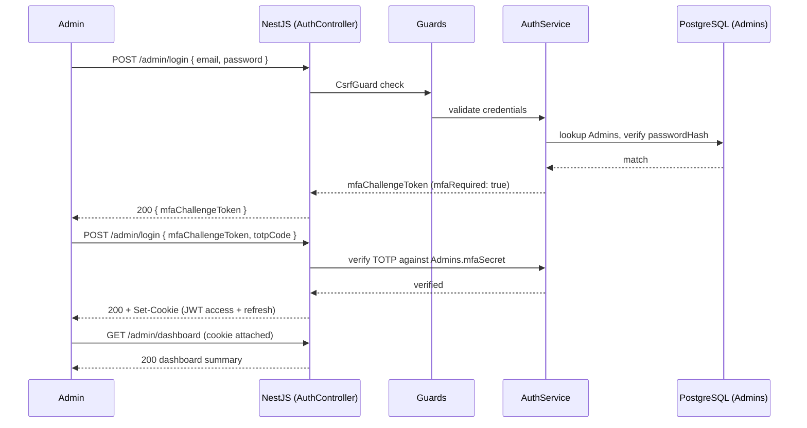
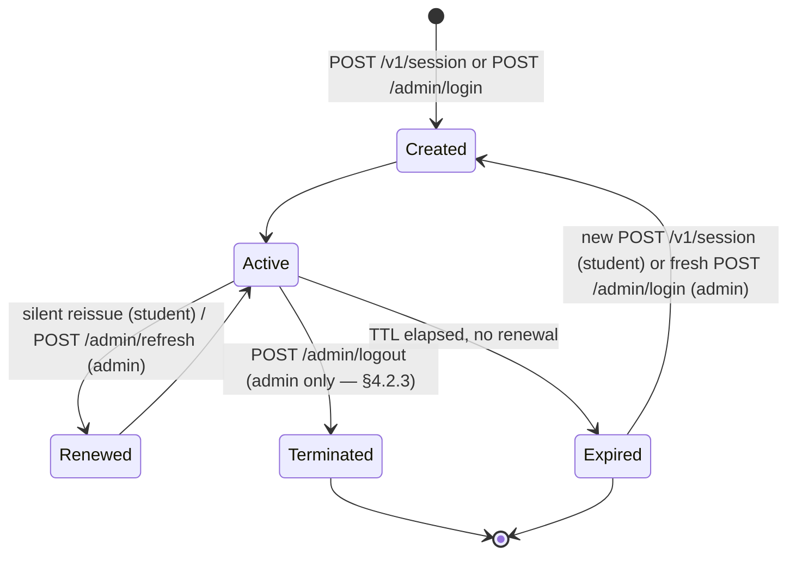
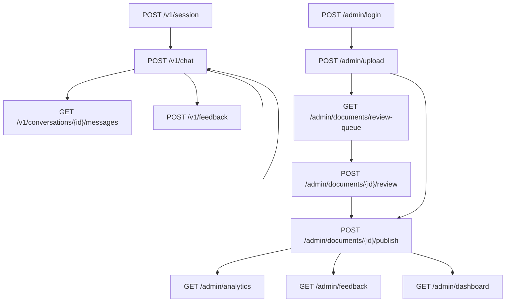
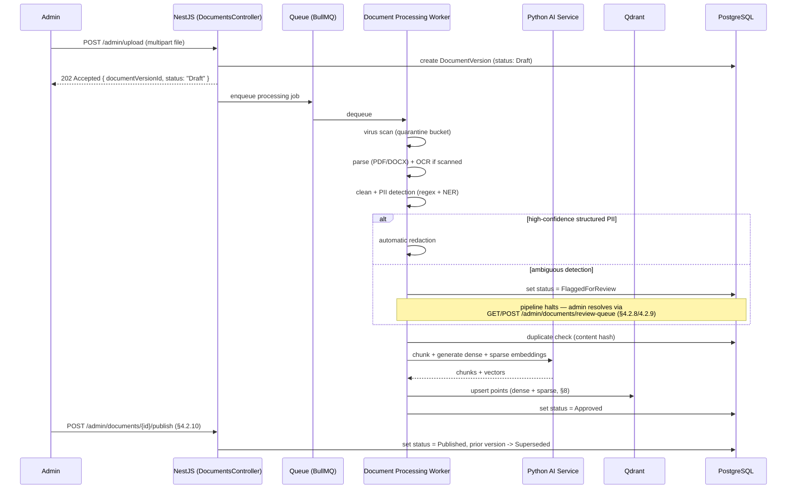
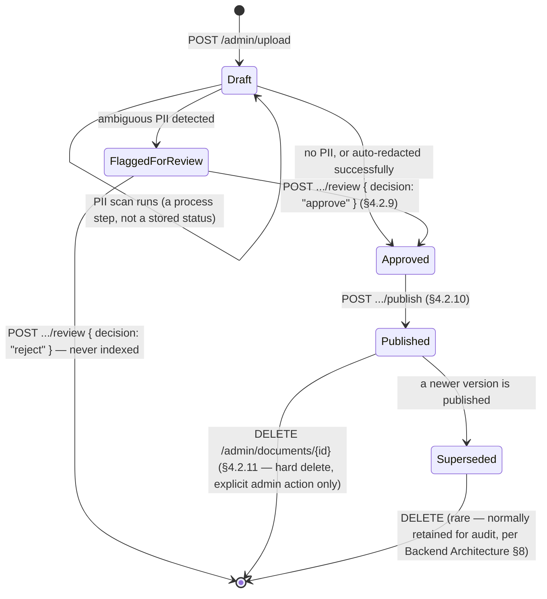
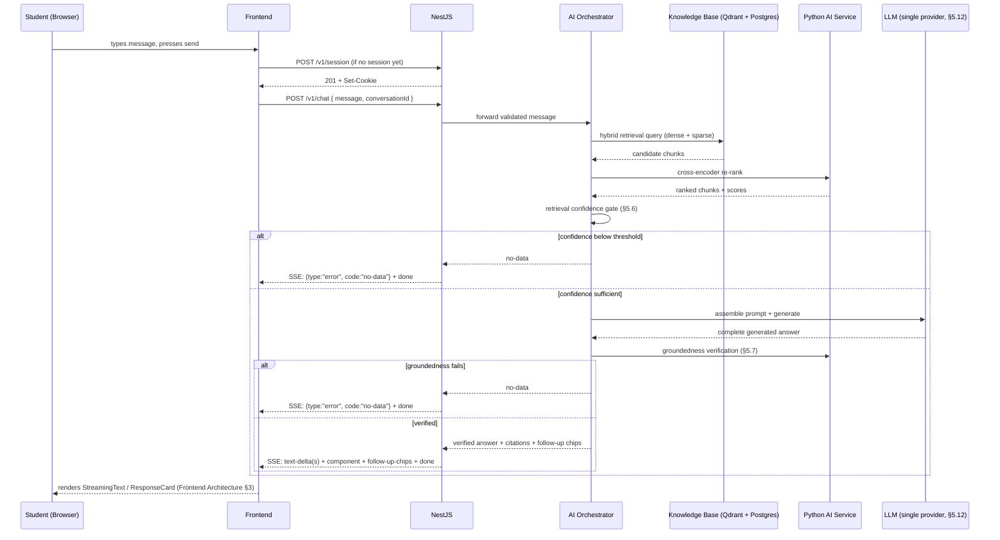
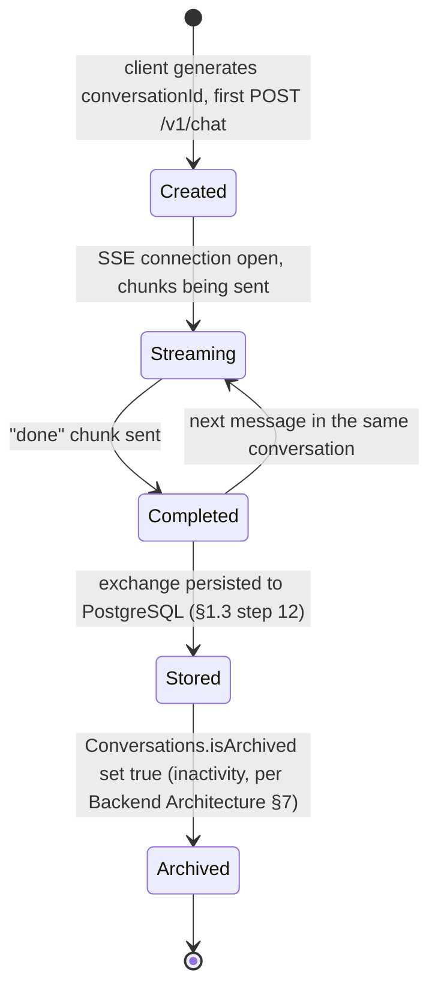

# GCE Tirunelveli AI Assistant — API Specification Document

**Derived strictly from:** Conversation Design v2, Frontend Architecture, and Backend Architecture (Version 2). This document does not introduce new product behavior, pipeline stages, authentication models, or security decisions — it specifies the wire contract for what those documents already define. Where an endpoint or field is not explicitly named in a prior document but is clearly required to implement it, it is added here as the **smallest architecturally consistent addition** and marked `[NEW — assumption]` at first mention, with a one-line justification.

---

## 1. Introduction

### 1.1 Purpose
This document specifies every HTTP and streaming endpoint required to implement the approved Conversation Design, Frontend Architecture, and Backend Architecture as a working system. It is written to let a backend team implement routes and a frontend team integrate against them without further API design decisions.

### 1.2 Scope
Covers the public student-facing API, the admin API, internal health/metrics endpoints, and the streaming chat protocol. Does not cover UI behavior (Frontend Architecture), conversational tone/content (Conversation Design v2), or internal pipeline mechanics beyond what's needed to specify request/response shape (Backend Architecture).

### 1.3 API design principles
- **One contract, two consumers:** every endpoint here serves both the approved Next.js frontend and, per Backend Architecture §20, a future mobile client — nothing is designed in a way that only a browser could call.
- **The stream chunk contract is fixed, not renegotiated:** Frontend Architecture §5.2's `text-delta` / `component` / `follow-up-chips` / `error` / `done` shape is treated as load-bearing and reproduced exactly in §5 of this document.
- **Refusal is a normal, first-class response, not an error to work around:** per Backend Architecture §5.6/§5.7, "no official information found" is a designed outcome, not a failure mode — it is specified here with the same care as a successful answer.
- **No endpoint bypasses the hallucination-prevention gates:** there is no "raw retrieval" or "unverified answer" endpoint anywhere in this specification — the two gates in Backend Architecture §5.6/§5.7 sit between every request and every answer, with no side door.

### 1.4 REST standards
- Resource-oriented URLs, plural nouns, kebab-case path segments (`/admin/documents`, `/admin/review-queue`).
- `GET` never mutates state; `POST` creates or performs an action; `PATCH` partially updates; `DELETE` removes (soft, per Backend Architecture §8's deletion policy, unless explicitly a hard delete).
- JSON field names are `camelCase` throughout, matching every prior document's examples (`sessionId`, `conversationId`, `documentVersionId`).

### 1.5 Versioning strategy
All public and admin routes are prefixed `/v1/` or `/admin/` (admin routes are implicitly versioned alongside `/v1` — a breaking admin change also bumps to `/admin/v2/` if it ever occurs). This matches Backend Architecture §4.1 exactly: breaking changes get a new version prefix, not in-place modification.

### 1.6 Base URLs
| Environment | Base URL |
|---|---|
| Production | `https://api.gcetly.ac.in` |
| Staging | `https://api-staging.gcetly.ac.in` |
| Local development | `http://localhost:3000` |

`[NEW — assumption]` Concrete hostnames were not specified in prior documents; these follow directly from the CORS allow-list already fixed in Backend Architecture §12 (`gcetly.ac.in`, `www.gcetly.ac.in`, `staging.gcetly.ac.in`) and are the smallest consistent naming for the API host itself.

### 1.7 Content types
- Request/response bodies: `application/json; charset=utf-8`.
- Document upload: `multipart/form-data`.
- Streaming chat: `text/event-stream` (Server-Sent Events — see §5).

### 1.8 Naming conventions
- IDs: UUIDv4 strings everywhere (`sessionId`, `conversationId`, `messageId`, `documentId`, `documentVersionId`, `chunkId`).
- Timestamps: ISO 8601, UTC, e.g. `2026-07-25T10:15:30Z` — never epoch millis, never a local-timezone string.
- Booleans read as assertions: `isActive`, `isHelpful`, `mfaEnabled` — never ambiguous flags like `status: 1`.

### 1.9 Error handling philosophy
Every error — validation, auth, upstream failure — is normalized into one small, finite set of application error codes (§7.3), directly reflecting Backend Architecture §13's principle: *the API's job is to classify failures into an existing small set, never to invent new client-facing states per endpoint.* No endpoint defines its own bespoke error vocabulary.

---

## 2. Authentication

This section reproduces Backend Architecture §10/§12's decisions exactly — session/token storage, MFA, and CSRF protection are not re-litigated here.

### 2.1 Anonymous student session
No login is required to chat, per the approved Conversation Design. `POST /v1/session` issues a session identified by an **httpOnly, Secure, `SameSite=Lax` cookie** — never returned in a JSON body, never stored in `localStorage` — so it is inaccessible to JavaScript and not exposed by an XSS vulnerability in either the widget or its host page.

### 2.2 Admin authentication — JWT flow
`Email → Password → TOTP MFA → JWT issuance`, exactly as specified in Backend Architecture §10. MFA is **mandatory for every administrator, with no opt-out.** Both the access token and refresh token are delivered as httpOnly, Secure, `SameSite=Lax` cookies — never in a JSON response body for client-side storage.

### 2.3 Refresh token flow
Refresh tokens rotate on every use: exchanging one immediately invalidates it and issues a new one. Reuse of an already-invalidated refresh token is treated as a security event and can revoke the entire token family for that admin (Backend Architecture §10).

### 2.4 Session lifecycle
| Token | Lifetime | Renewal |
|---|---|---|
| Student session cookie | Short-lived, rotate-on-use | Silently reissued by `POST /v1/session` if expired; a new anonymous session simply starts |
| Admin access token | 15 minutes | Via `POST /admin/refresh` |
| Admin refresh token | 7 days | Rotates on every refresh; a stale refresh token requires a fresh `POST /admin/login` |

### 2.5 Authorization headers
Because both student and admin credentials are cookie-delivered, **no `Authorization: Bearer` header is required or expected from the browser client** — the cookie is sent automatically. `[NEW — assumption]` For the future mobile client noted in Backend Architecture §20 (which cannot rely on browser cookie handling the same way), this specification reserves `Authorization: Bearer <token>` as an **optional alternate** authentication path, validated identically server-side, activated only when that client ships — it is not active for the current web widget and introduces no behavior change today.

### 2.6 CSRF protection
Every state-changing request (`POST` / `PATCH` / `DELETE`) must include an `X-CSRF-Token` header matching a separate, readable (non-httpOnly) CSRF cookie issued alongside the session/auth cookie — the double-submit cookie pattern fixed in Backend Architecture §12. A mismatched or missing token on a state-changing request is rejected with `csrf-invalid` (§7.3) before the request reaches any service.

### 2.7 Security requirements
- All auth endpoints behind stricter rate limits than general traffic (§2.8).
- All admin auth events (login, failed login, MFA failure, refresh, revocation) are audit-logged per Backend Architecture §14.
- CORS is restricted to the exact origins in §8.3 — no route is reachable from an unlisted origin, authenticated or not.

### 2.8 Rate limits
| Scope | Limit | Applies to |
|---|---|---|
| Per-session | Generous (default: 20 requests/min) | `/v1/chat` |
| Per-IP, general | Moderate (default: 100 requests/min) | All `/v1/*` and `/admin/*` routes |
| Per-IP, auth-specific | Strict (default: 5 requests/min) | `/admin/login`, `/admin/refresh` |

Exceeding a limit returns `429` with error code `rate-limited` (§7.3), including a `Retry-After` header.

### 2.9 Admin login flow (sequence diagram)
Renders the exact `Email → Password → TOTP MFA → JWT` sequence from §2.2/§4.2.1 as a Mermaid sequence diagram — no step added, none reordered:



### 2.10 Session lifecycle (state diagram)
Two distinct lifecycles share this shape — student session and admin token — with one structural difference called out explicitly rather than glossed over: **student sessions have no explicit `Terminated` action** (no "log out" concept for anonymous chat, per Conversation Design v2); only admin sessions reach `Terminated` via `POST /admin/logout` (§4.2.3).



---

## 3. API Architecture

This mirrors Backend Architecture §1/§3 — this document does not redefine these layers, only shows where each endpoint enters them.

```
Client
  ↓ HTTPS (cookie attached automatically)
NGINX (API Gateway) — TLS, rate limiting, CORS preflight
  ↓
NestJS Controller — route match, DTO validation (class-validator)
  ↓
Guards — AuthGuard (session/JWT), RolesGuard (admin RBAC), CsrfGuard
  ↓
Service layer — ChatService / DocumentsService / AdminService / etc.
  ↓ (chat only)
AI Orchestrator → Knowledge Base (Qdrant + Postgres) → Python AI Service (embeddings, cross-encoder re-ranking, groundedness verification) → LLM Gateway (OpenAI, v1 single provider)
  ↓
Global Exception Filter — normalizes any failure into §7.3's error codes
  ↓
Response (JSON or SSE stream)
```

`[NEW — assumption]` The **Python AI Service** named in this document's required stack is not a separate concept from anything in Backend Architecture — that document specified embedding generation, cross-encoder re-ranking, and groundedness verification as pipeline stages without naming an implementation language. Given these are ML-model-inference steps (commonly Python-hosted even inside a primarily Node/NestJS system), this specification treats them as an **internal-only** service the Orchestrator calls over an internal network boundary — never exposed as a public route, never reachable from the frontend directly, and invisible to any endpoint's public contract in this document. This is the smallest consistent way to reconcile "NestJS backend" with "Python AI Service" without contradicting Backend Architecture's module boundaries.

- **Gateway:** NGINX — TLS termination, CORS preflight handling, coarse rate limiting (Backend Architecture §12).
- **Controllers:** one per NestJS module (`chat`, `documents`, `admin`, `auth`, `monitoring`) — thin, delegate immediately to services.
- **Services:** own business logic; the only layer that talks to repositories, the Orchestrator, or the LLM Gateway.
- **Validation:** `class-validator` DTOs on every request body before it reaches a service (Backend Architecture §4.3) — malformed input never reaches the Orchestrator or database.
- **Error pipeline:** a single global exception filter, per Backend Architecture §13 — never a per-controller try/catch inventing its own shape.
- **AI Orchestrator integration:** only `POST /v1/chat` touches the Orchestrator. No other endpoint in this document performs retrieval, generation, or verification.

### 3.1 Detailed request flow — `POST /v1/chat`
The diagram above shows every request's shared path; the chat request specifically continues through the full AI pipeline once it reaches the Orchestrator. Shown here at the granularity the AI pipeline stages warrant, matching Backend Architecture §5 exactly — no stage renamed, none added:

```
Client
  ↓
NGINX
  ↓
NestJS Controller  (ChatController — DTO validation)
  ↓
Guards  (AuthGuard → CsrfGuard)
  ↓
Service  (ChatService)
  ↓
AI Orchestrator
  ↓
Knowledge Base  (hybrid dense + sparse search, Qdrant + Postgres — §5.5)
  ↓
Cross-Encoder Re-ranker  (§5.8 — degrades to fusion-only ranking if unavailable, never fails the request)
  ↓
Retrieval Confidence Gate  (§5.6 — below threshold exits here with "no-data", skipping every stage below)
  ↓
LLM  (Gateway → single primary provider, §5.9)
  ↓
Groundedness Verification  (§5.7 — fails here exits with "no-data", never reaching the client)
  ↓
Streaming Response  (§5 — verified content only, server-paced replay)
```

This is the same lifecycle already narrated in Backend Architecture §1.3; this diagram exists to give it one glance-able shape rather than requiring a re-read of that section's numbered prose.

### 3.2 API-layer folder structure
The subset of Backend Architecture's full folder structure (its own §3) relevant to this document — the routing, validation, and guard layers that give these endpoints their shape. This is not a competing structure; it is the API-facing slice of the same tree, reproduced here for convenience:

```
src/
├── modules/
│   ├── chat/
│   │   ├── controllers/        # ChatController — POST /v1/chat, GET /v1/conversations/:id/messages
│   │   ├── services/           # ChatService
│   │   └── dto/                # ChatRequestDto, ConversationHistoryQueryDto
│   ├── documents/
│   │   ├── controllers/        # DocumentsController (public), Admin DocumentsController
│   │   ├── services/
│   │   └── dto/                # UploadDocumentDto, PublishDocumentDto, ReviewDecisionDto
│   ├── admin/
│   │   ├── controllers/        # AdminController — analytics, feedback, dashboard, config, announcements, faqs
│   │   ├── services/
│   │   └── dto/                # AnnouncementDto, FaqDto, ConfigUpdateDto
│   ├── auth/
│   │   ├── controllers/        # AuthController — /v1/session, /admin/login, /admin/refresh, /admin/logout
│   │   ├── services/
│   │   └── dto/                # CreateSessionDto, LoginDto, MfaVerifyDto
│   ├── analytics/
│   │   └── controllers/        # /admin/analytics
│   └── monitoring/
│       └── controllers/        # /v1/health, /v1/health/deep, /metrics
├── common/
│   ├── guards/                 # AuthGuard, RolesGuard, CsrfGuard
│   ├── middleware/              # Correlation-ID assignment, Helmet
│   ├── filters/                 # Global exception filter (§7)
│   └── pipes/                    # class-validator ValidationPipe
```

Matches Backend Architecture §3 exactly at every level this document touches — no module, guard, or filter named here that isn't already defined there.

---

## 4. Endpoint Specifications

Endpoints are grouped by audience. Each entry follows the same template: Purpose, Method, URL, Auth, Headers, Path/Query params, Request/Response body, Success/Error responses, Validation rules, Business rules, Notes.

### 4.0 Complete API endpoint summary

One-page reference for every endpoint in this document. Full detail for each is in §4.1–§4.3; this table introduces nothing not already specified there.

| Method | Endpoint | Purpose | Auth required | Response type |
|---|---|---|---|---|
| `POST` | `/v1/session` | Establish anonymous student session | None | JSON |
| `POST` | `/v1/chat` | Submit a message, receive a grounded, verified answer | Student session cookie | SSE |
| `GET` | `/v1/conversations/{conversationId}/messages` | Fetch prior messages to resume a session | Student session cookie | JSON |
| `POST` | `/v1/feedback` | Record helpful/not-helpful signal on a message | Student session cookie | JSON |
| `GET` | `/v1/documents` | List/search publicly citable documents | None | JSON |
| `GET` | `/v1/health` | Liveness check | None | JSON |
| `POST` | `/admin/login` | Admin credential + MFA exchange | None (issues credential) | JSON |
| `POST` | `/admin/refresh` | Rotate admin access token | Refresh token cookie | JSON |
| `POST` | `/admin/logout` | Invalidate admin session | Admin access token | JSON |
| `POST` | `/admin/upload` | Upload a new official document | Admin JWT (`documents:write`) | JSON |
| `GET` | `/admin/documents` | List all documents, any status | Admin JWT (`documents:read`) | JSON |
| `PATCH` | `/admin/documents/{documentId}` | Update metadata / trigger re-index | Admin JWT (`documents:write`) | JSON |
| `GET` | `/admin/documents/{documentId}/versions` | List a document's version history | Admin JWT (`documents:read`) | JSON |
| `GET` | `/admin/documents/review-queue` | List versions flagged for PII review | Admin JWT (`documents:review`) | JSON |
| `POST` | `/admin/documents/{documentVersionId}/review` | Resolve a flagged version | Admin JWT (`documents:review`) | JSON |
| `POST` | `/admin/documents/{documentVersionId}/publish` | Publish an approved version | Admin JWT (`documents:publish`) | JSON |
| `DELETE` | `/admin/documents/{documentId}` | Hard-delete a document | Admin JWT (`documents:delete`) | JSON |
| `GET` / `POST` | `/admin/announcements` | Manage time-sensitive notices | Admin JWT (`announcements:read`/`write`) | JSON |
| `GET` / `POST` / `PATCH` | `/admin/faqs` | Manage curated FAQ entries | Admin JWT (`faqs:read`/`write`) | JSON |
| `GET` | `/admin/analytics` | Usage metrics, top/unanswered questions | Admin JWT (`analytics:read`) | JSON |
| `GET` | `/admin/feedback` | Review submitted student feedback | Admin JWT (`feedback:read`) | JSON |
| `GET` | `/admin/dashboard` | Aggregated admin landing summary | Admin JWT (any role) | JSON |
| `GET` / `PATCH` | `/admin/config` | View/adjust retrieval tunables | Admin JWT (`config:read`/`write`) | JSON |
| `GET` | `/v1/health/deep` | Readiness check (DB/Redis/Qdrant/LLM) | Internal network only | JSON |
| `GET` | `/metrics` | Prometheus metrics scrape | Internal network only | Prometheus text |

### 4.0.1 Endpoint dependency diagram
Shows the realistic order endpoints are called in by each audience — not a technical call graph (no endpoint calls another endpoint server-side), but the client-side sequence each user type actually follows:

```
Student
  ↓
POST /v1/session            (silent, on first widget interaction)
  ↓
POST /v1/chat                (repeatable — the core loop)
  ↓
GET /v1/conversations/{id}/messages   (only on a resumed/reopened session)
  ↓
POST /v1/feedback             (optional, per message)

Admin
  ↓
POST /admin/login → POST /admin/login (MFA step)
  ↓
POST /admin/upload
  ↓
GET /admin/documents/review-queue → POST /admin/documents/{id}/review   (only if PII-flagged)
  ↓
POST /admin/documents/{id}/publish
  ↓
GET /admin/analytics  /  GET /admin/feedback  /  GET /admin/dashboard   (ongoing, any order)
```

`GET /v1/documents`, `GET /v1/health`, `/admin/announcements`, `/admin/faqs`, and `/admin/config` are intentionally omitted from this diagram — they're accessed independently of the core session/chat and login/publish sequences above, not as a dependency step within either.

### 4.0.2 API dependency diagram (Mermaid)
The same relationships as §4.0.1, rendered as a proper dependency graph for tooling that renders Mermaid — not a different structure, the same one in a diagram-rendering format:



`B --> B` denotes that `POST /v1/chat` is the repeatable core loop (§4.0.1); `H --> I` denotes that publishing an initially-flagged version depends on its review being resolved first — a document that skips PII review can never reach `/publish` (Backend Architecture §9's state machine enforces this server-side, this diagram simply makes the client-visible consequence explicit).

### 4.1 Student-facing endpoints

#### 4.1.1 `POST /v1/session`
**Purpose:** Establish (or silently re-establish) an anonymous student session.
**Auth:** None required — this endpoint issues the credential.
**Headers:** `Content-Type: application/json` (empty body accepted).
**Path/Query params:** None.
**Request body:** `{}` (no fields required; reserved for future client metadata such as locale).
**Response body (success):**
```json
{
  "success": true,
  "data": {
    "sessionId": "8f14e45f-ceea-4b8c-9d16-3a1b2c4e5f60",
    "expiresAt": "2026-07-25T22:00:00Z"
  }
}
```
The session token itself is **not** in this body — it is set via `Set-Cookie` (httpOnly, Secure, `SameSite=Lax`).
**Success responses:** `201 Created`.
**Error responses:** `503` (`server-busy`) if Redis/Postgres are unreachable to persist the session (Backend Architecture §13).
**Validation rules:** None beyond standard JSON parsing.
**Business rules:** Idempotent-in-effect — calling this with an existing valid session cookie present simply returns the existing session's `sessionId`/`expiresAt` rather than creating a duplicate (Backend Architecture §11's session cache is checked first).
**Notes:** The frontend calls this once, automatically, on first widget interaction — this is the concrete implementation of Frontend Architecture §4's "Welcome Popup → Start Chat" flow acquiring a session before the first message is sent.

---

#### 4.1.2 `POST /v1/chat`
**Purpose:** The core endpoint — submit a message and receive a streamed, grounded, verified answer.
**Auth:** Student session cookie required.
**Headers:** `Content-Type: application/json`, `X-CSRF-Token`, `Accept: text/event-stream`.
**Path/Query params:** None.
**Request body:**
```json
{
  "message": "What's the EEE tuition fee?",
  "conversationId": "b2f1a7c0-6e2d-4b1a-9c3e-1d4f5a6b7c8d",
  "activeEntity": "Electronics and Instrumentation Engineering"
}
```
- `message` (string, required)
- `conversationId` (UUID, required — client generates a new one to start a fresh conversation)
- `activeEntity` (string, optional) — the currently-resolved pronoun-referent entity, per Conversation Design v2 §11 / Backend Architecture §5.3, allowing the client to hint context across turns

**Response body:** A stream of newline-delimited JSON chunks — see §5 for the full contract. Not a single JSON body.
**Success responses:** `200 OK` (stream opens; individual chunks may still carry `type: "error"` — see §5.6).
**Error responses (pre-stream, before any chunk is sent):** `400` (`validation-error`), `401` (`unauthorized`), `403` (`csrf-invalid`), `429` (`rate-limited`).
**Validation rules:** `message` 1–2000 characters (§6.4), stripped of control characters; `conversationId` must be a syntactically valid UUID.
**Business rules:** Every answer passes through both hallucination-prevention gates (Backend Architecture §5.6, §5.7) before any `component`/`text-delta` chunk is emitted — this endpoint has no code path that streams an unverified answer.
**Notes:** See §5 for the complete streaming contract, including the exact chunk types and an end-to-end example.

---

#### 4.1.3 `GET /v1/conversations/{conversationId}/messages`
`[NEW — assumption]` Not explicitly named as a public route in Backend Architecture, but required to implement Frontend Architecture §4's "returning visitor... resumes existing `.chat-scroll` content" behavior — a resumed session needs somewhere to fetch prior turns from. Smallest consistent addition: a read-only history endpoint scoped to the caller's own session.

**Purpose:** Fetch prior messages in a conversation, to resume a session client-side.
**Auth:** Student session cookie required; the conversation must belong to the requesting session (enforced server-side, not just client-trusted).
**Headers:** `Content-Type: application/json`.
**Path parameters:** `conversationId` (UUID, required).
**Query parameters:** `cursor` (opaque string, optional — pagination, §9.3), `limit` (integer, optional, default 20, max 50).
**Request body:** None.
**Response body:**
```json
{
  "success": true,
  "data": {
    "messages": [
      {
        "messageId": "3c9e1a2b-...",
        "role": "user",
        "content": "What's the EEE tuition fee?",
        "createdAt": "2026-07-25T10:15:28Z"
      },
      {
        "messageId": "4d0f2b3c-...",
        "role": "assistant",
        "content": "The EEE tuition fee for the current academic year is...",
        "componentType": "resp-card",
        "citations": [
          { "documentId": "6b2e...", "title": "Fee Structure 2026", "section": "Department-wise Fees" }
        ],
        "createdAt": "2026-07-25T10:15:31Z"
      }
    ],
    "nextCursor": "eyJjcmVhdGVkQXQiOiIyMDI2LTA3LTI1VDEwOjE1OjI4WiJ9"
  }
}
```
**Success responses:** `200 OK`.
**Error responses:** `403` (`forbidden`, conversation belongs to a different session), `404` (`not-found`).
**Validation rules:** `limit` clamped to 1–50; invalid `cursor` returns `400` (`validation-error`), not a silent reset to page 1.
**Business rules:** Never returns a message whose groundedness check failed (Backend Architecture §5.7) — a failed generation was never persisted as a deliverable message in the first place, so there is nothing to hide here; history is exclusively the record of what the user actually saw.
**Notes:** Ordered oldest-first, matching natural reading order in `.chat-scroll`.

---

#### 4.1.4 `POST /v1/feedback`
**Purpose:** Record the `.like-btn` signal (and optional free text) against a message.
**Auth:** Student session cookie required.
**Headers:** `Content-Type: application/json`, `X-CSRF-Token`.
**Request body:**
```json
{
  "messageId": "4d0f2b3c-...",
  "isHelpful": true,
  "freeText": "Clear and quick, thanks!"
}
```
`freeText` is optional.
**Response body:**
```json
{ "success": true, "data": { "feedbackId": "9a1b...", "createdAt": "2026-07-25T10:16:02Z" } }
```
**Success responses:** `201 Created`.
**Error responses:** `400` (`validation-error`), `404` (`not-found` — unknown `messageId`), `403` (`csrf-invalid`).
**Validation rules:** `messageId` must reference a message belonging to the caller's own session; `freeText` capped at 500 characters.
**Business rules:** One feedback row per message per session — a resubmission updates the existing row (`isHelpful`/`freeText`) rather than creating a duplicate.
**Notes:** Feedback is never used to alter retrieval or generation in real time — it feeds the admin-facing `GET /admin/feedback` (§4.2.11) review queue only, consistent with Backend Architecture treating feedback as an offline signal, not a live ranking input.

---

#### 4.1.5 `GET /v1/documents`
**Purpose:** List publicly citable official documents — the transparency endpoint from Backend Architecture §4.2, letting anyone see what the assistant is grounded in.
**Auth:** None (public).
**Query parameters:**
| Param | Type | Default | Notes |
|---|---|---|---|
| `department` | string | — | Filter by department code |
| `documentType` | string | — | e.g. `fee-structure`, `circular`, `policy` |
| `q` | string | — | Free-text search over document titles (§4.1.6) |
| `cursor` | string | — | Pagination (§9.3) |
| `limit` | integer | 20 | Max 50 |

**Response body:**
```json
{
  "success": true,
  "data": {
    "documents": [
      {
        "documentId": "6b2e...",
        "title": "Fee Structure 2026",
        "department": "EEE",
        "documentType": "fee-structure",
        "publishedDate": "2026-06-01",
        "currentVersionNumber": 3
      }
    ],
    "nextCursor": null
  }
}
```
**Success responses:** `200 OK`.
**Error responses:** `400` (`validation-error` — unrecognized `documentType`).
**Validation rules:** `q` capped at 200 characters.
**Business rules:** Only documents with a `Published` current version are listed (Backend Architecture §9's state machine) — `Draft`/`FlaggedForReview`/`Superseded` versions never appear here, by construction, not by a filter that could be forgotten.
**Notes:** This is the same document list the citations in `.verified-badge`/`.source-line` link back to.

#### 4.1.6 Document Search
Implemented as the `q` query parameter on `GET /v1/documents` above (§4.1.5), not a separate route — full-text search over document titles/metadata, backed by the same PostgreSQL layer (not the RAG vector index, which is internal to `/v1/chat`'s Orchestrator only). Kept as one endpoint rather than two to avoid two divergent document-listing code paths.

---

#### 4.1.7 `GET /v1/health`
**Purpose:** Shallow liveness check.
**Auth:** None.
**Response body:** `{ "success": true, "data": { "status": "ok" } }`
**Success responses:** `200 OK`.
**Error responses:** None — if the process can respond at all, this always returns `200`.
**Notes:** Used by the load balancer for basic liveness routing (Backend Architecture §15).

---

### 4.2 Admin endpoints

All admin endpoints require a valid admin access-token cookie (§2.2) and the appropriate RBAC permission (Backend Architecture §10's resource+action model) unless stated otherwise. All are subject to CSRF protection (§2.6) for state-changing methods.

#### 4.2.1 `POST /admin/login`
**Purpose:** Admin credential exchange, culminating in MFA-verified JWT issuance.
**Auth:** None (this endpoint issues it) — but see business rules for the two-step nature of this flow.
**Request body (step 1 — password):**
```json
{ "email": "registrar@gcetly.ac.in", "password": "•••••••••" }
```
**Response body (step 1 success — MFA required):**
```json
{ "success": true, "data": { "mfaChallengeToken": "eyJhbGciOi...", "mfaRequired": true } }
```
**Request body (step 2 — TOTP verification):**
```json
{ "mfaChallengeToken": "eyJhbGciOi...", "totpCode": "482913" }
```
**Response body (step 2 success):**
```json
{ "success": true, "data": { "adminId": "1f2e...", "role": "ContentEditor" } }
```
Access and refresh tokens are set via `Set-Cookie`, never in this body.
**Success responses:** `200 OK` at each step.
**Error responses:** `401` (`unauthorized` — bad password, or bad/expired TOTP code), `429` (`rate-limited` — this endpoint has the strictest tier, §2.8).
**Validation rules:** `email` valid format; `totpCode` exactly 6 digits.
**Business rules:** **MFA is mandatory for every role, with no bypass** — step 2 cannot be skipped for any admin account, matching Backend Architecture §10 exactly. `mfaChallengeToken` is single-use and expires in 5 minutes.
**Notes:** This two-step shape is the smallest way to represent "Email → Password → TOTP → JWT" as discrete HTTP calls without inventing a third endpoint.

---

#### 4.2.2 `POST /admin/refresh`
**Purpose:** Rotate the access token using the refresh token cookie.
**Auth:** Valid refresh token cookie.
**Request body:** None.
**Response body:** `{ "success": true, "data": { "expiresAt": "2026-07-25T10:30:00Z" } }` — new access + refresh cookies set via `Set-Cookie`.
**Success responses:** `200 OK`.
**Error responses:** `401` (`unauthorized` — refresh token missing, expired, or already-used/rotated, per Backend Architecture §10's reuse-detection rule).
**Business rules:** The presented refresh token is invalidated immediately upon use, whether or not this call succeeds — reuse of an invalidated token revokes the entire token family (§2.3) and is logged as a security event.

---

#### 4.2.3 `POST /admin/logout`
`[NEW — assumption]` Required to cleanly invalidate a refresh token and clear cookies — the smallest necessary complement to §4.2.2's rotation logic; without it, a "logged out" admin's refresh token would otherwise remain valid until natural expiry.
**Purpose:** Invalidate the current admin session.
**Auth:** Valid access token cookie.
**Response body:** `{ "success": true, "data": {} }` — auth cookies cleared via `Set-Cookie` with immediate expiry.
**Success responses:** `200 OK`.
**Business rules:** The refresh token is explicitly revoked server-side (row marked `revokedAt`, Backend Architecture §7's `RefreshTokens` table), not just cookie-cleared client-side.

---

#### 4.2.4 `POST /admin/upload`
**Purpose:** Upload a new official document for ingestion.
**Auth:** Admin JWT + `documents:write` permission.
**Headers:** `Content-Type: multipart/form-data`, `X-CSRF-Token`.
**Request body (multipart fields):**
| Field | Type | Required |
|---|---|---|
| `file` | binary (PDF/DOCX) | Yes |
| `title` | string | Yes |
| `department` | string | Yes |
| `documentType` | string | Yes |

**Response body:**
```json
{
  "success": true,
  "data": {
    "documentId": "6b2e...",
    "documentVersionId": "7c3f...",
    "status": "Draft"
  }
}
```
**Success responses:** `202 Accepted` — processing is asynchronous (Backend Architecture §9); the response confirms the upload was received, not that it's indexed.
**Error responses:** `400` (`validation-error` — missing fields, unsupported file type), `413` (`payload-too-large`), `403` (`forbidden` — insufficient role).
**Validation rules:** File type restricted to PDF/DOCX (§6.5); file size capped (default 25 MB); MIME type verified server-side, not trusted from the client-supplied extension.
**Business rules:** The new `DocumentVersion` starts in `Draft` state and moves through `PII detection → redaction/review → Approved → Published` entirely asynchronously (Backend Architecture §9) — this endpoint never blocks on that pipeline.
**Notes:** Poll `GET /admin/documents/{documentId}/versions` (§4.2.7) or the review queue (§4.2.8) for status.

---

#### 4.2.5 `GET /admin/documents`
**Purpose:** List all documents (any status), for admin management.
**Auth:** Admin JWT + `documents:read` permission.
**Query parameters:** `status` (`Draft`/`FlaggedForReview`/`Approved`/`Published`/`Superseded`), `department`, `cursor`, `limit` (default 20, max 50).
**Response body:** Same shape as `GET /v1/documents` (§4.1.5) plus a `status` field per document, and including non-`Published` documents.
**Success responses:** `200 OK`.
**Error responses:** `403` (`forbidden`).

---

#### 4.2.6 `PATCH /admin/documents/{documentId}`
**Purpose:** Update document metadata or trigger re-indexing.
**Auth:** Admin JWT + `documents:write` permission.
**Path parameters:** `documentId` (UUID).
**Request body:**
```json
{ "title": "Fee Structure 2026 (Revised)", "department": "EEE", "reindex": true }
```
All fields optional; `reindex: true` re-runs chunking/embedding on the current `Published` version without requiring a new file upload.
**Response body:** `{ "success": true, "data": { "documentId": "6b2e...", "updatedAt": "2026-07-25T11:00:00Z" } }`
**Success responses:** `200 OK`.
**Error responses:** `404` (`not-found`), `403` (`forbidden`).

---

#### 4.2.7 `GET /admin/documents/{documentId}/versions`
`[NEW — assumption]` The `DocumentVersions` entity is fully specified in Backend Architecture §7/§9; this is the minimal read endpoint needed to expose that version history to the admin dashboard, satisfying the "Document Versions" endpoint explicitly requested.
**Purpose:** List all versions of a document, including superseded ones, for audit purposes.
**Auth:** Admin JWT + `documents:read` permission.
**Response body:**
```json
{
  "success": true,
  "data": {
    "versions": [
      { "documentVersionId": "7c3f...", "versionNumber": 3, "status": "Published", "indexedAt": "2026-06-01T09:00:00Z" },
      { "documentVersionId": "5a1d...", "versionNumber": 2, "status": "Superseded", "indexedAt": "2025-06-01T09:00:00Z" }
    ]
  }
}
```
**Success responses:** `200 OK`. **Error responses:** `404` (`not-found`).

---

#### 4.2.8 `GET /admin/documents/review-queue`
`[NEW — assumption]` Required to expose the PII-review workflow from Backend Architecture §9 step 7 (`FlaggedForReview` state) to an admin — without a queue view, that state would be invisible and the pipeline would stall silently.
**Purpose:** List document versions currently `FlaggedForReview`, awaiting a human decision on ambiguous PII detections.
**Auth:** Admin JWT + `documents:review` permission.
**Response body:**
```json
{
  "success": true,
  "data": {
    "items": [
      {
        "documentVersionId": "9e4a...",
        "documentId": "6b2e...",
        "title": "Admission List 2026 (Draft)",
        "flaggedReason": "Ambiguous name-shaped entity detected outside expected contact context",
        "flaggedAt": "2026-07-25T09:12:00Z"
      }
    ]
  }
}
```
**Success responses:** `200 OK`.

---

#### 4.2.9 `POST /admin/documents/{documentVersionId}/review`
`[NEW — assumption]` The action counterpart to §4.2.8 — resolves a flagged version, per Backend Architecture §9's requirement that a `FlaggedForReview` version cannot proceed to chunking/embedding without explicit admin action.
**Purpose:** Approve, reject, or edit-and-approve a flagged document version.
**Auth:** Admin JWT + `documents:review` permission.
**Request body:**
```json
{ "decision": "approve", "redactedText": null }
```
`decision` is one of `approve` / `reject`; `redactedText`, if provided, replaces the extracted text before the version proceeds (used when the admin manually redacts something the automatic pass missed).
**Response body:** `{ "success": true, "data": { "documentVersionId": "9e4a...", "status": "Approved" } }`
**Success responses:** `200 OK`.
**Error responses:** `400` (`validation-error` — invalid `decision`), `404` (`not-found`), `409` (`conflict` — version is no longer in `FlaggedForReview`, e.g. already resolved by another admin).
**Business rules:** `approve` transitions the version to `Approved` (eligible for `POST .../publish`, §4.2.10); `reject` transitions it to a terminal rejected state and it is never indexed.

---

#### 4.2.10 `POST /admin/documents/{documentVersionId}/publish`
**Purpose:** Publish an `Approved` document version, superseding the current `Published` version if one exists.
**Auth:** Admin JWT + `documents:publish` permission (deliberately separate from `documents:write`, so upload/edit and publish authority can be held by different roles).
**Response body:** `{ "success": true, "data": { "documentVersionId": "7c3f...", "status": "Published", "publishedAt": "2026-07-25T11:15:00Z" } }`
**Success responses:** `200 OK`.
**Error responses:** `409` (`conflict` — version is not in `Approved` state), `404` (`not-found`).
**Business rules:** The prior `Published` version (if any) transitions to `Superseded`; its vector points are set `isActive: false`, never deleted (Backend Architecture §8) — this endpoint is the trigger for that transition.

---

#### 4.2.11 `DELETE /admin/documents/{documentId}`
**Purpose:** Hard-delete a document — the rare, explicit action reserved for erroneous uploads (Backend Architecture §8's deletion policy: "hard deletion only on explicit admin action").
**Auth:** Admin JWT + `documents:delete` permission (a narrower permission than `write`, deliberately).
**Response body:** `{ "success": true, "data": { "documentId": "6b2e...", "deletedAt": "2026-07-25T11:20:00Z" } }`
**Success responses:** `200 OK`.
**Error responses:** `404` (`not-found`).
**Business rules:** This removes the document, all its versions, and their vector points permanently — distinct from the routine `Superseded` soft-state used for normal version updates. A confirmation flag is required in the request body (`{ "confirm": true }`) to guard against accidental calls; a request without it returns `400` (`validation-error`).

---

#### 4.2.12 `GET` / `POST` `/admin/announcements`
**Purpose:** Manage time-sensitive notices surfaced in chat (Backend Architecture §16's Announcement Sync worker consumes these).
**Auth:** Admin JWT + `announcements:read` (`GET`) / `announcements:write` (`POST`).
**Request body (`POST`):**
```json
{ "title": "Odd Semester Exam Schedule Released", "body": "Exams begin 18 November 2026.", "publishAt": "2026-07-25T00:00:00Z", "expiresAt": "2026-11-18T00:00:00Z", "priority": "high" }
```
**Response body (`GET`):** `{ "success": true, "data": { "announcements": [ { "announcementId": "...", "title": "...", "isActive": true } ] } }`
**Success responses:** `200 OK` / `201 Created`.
**Error responses:** `400` (`validation-error` — `expiresAt` before `publishAt`).

---

#### 4.2.13 `GET` / `POST` / `PATCH` `/admin/faqs`
**Purpose:** Manage curated FAQ entries — the fast-path retrieval source from Backend Architecture §6/§8.
**Auth:** Admin JWT + `faqs:read` / `faqs:write`.
**Request body (`POST`/`PATCH`):**
```json
{ "question": "What are the library timings?", "answer": "8:00 AM – 8:00 PM, Monday to Saturday.", "category": "library", "isActive": true }
```
**Response body:** Standard envelope with the created/updated FAQ object.
**Success responses:** `200 OK` / `201 Created`.
**Error responses:** `400` (`validation-error`), `404` (`not-found`, on `PATCH` to an unknown `faqId`).

---

#### 4.2.14 `GET /admin/analytics`
**Purpose:** Usage metrics, top questions, and the unanswered-question review queue (Backend Architecture §16).
**Auth:** Admin JWT + `analytics:read` permission.
**Query parameters:** `from`, `to` (ISO 8601 dates), `granularity` (`day`/`week`).
**Response body:**
```json
{
  "success": true,
  "data": {
    "totalConversations": 4213,
    "totalMessages": 11029,
    "noDataRate": 0.037,
    "groundednessFailureRate": 0.004,
    "topQuestions": [
      { "topic": "Hostel fees", "count": 812 },
      { "topic": "Admission cutoff", "count": 654 }
    ],
    "unansweredQuestions": [
      { "question": "Does GCE TLY have a swimming pool?", "count": 14 }
    ]
  }
}
```
**Success responses:** `200 OK`.
**Notes:** `groundednessFailureRate` is exposed here specifically because a sustained rise in it is one of Backend Architecture §15's named alert conditions — this endpoint is what a human looks at after that alert fires.

---

#### 4.2.15 `GET /admin/feedback`
`[NEW — assumption]` "User Feedback Review" was explicitly requested; `POST /v1/feedback` (§4.1.4) writes feedback but Backend Architecture never specified an admin-facing read endpoint for it — this is the minimal complement.
**Purpose:** Review submitted student feedback.
**Auth:** Admin JWT + `feedback:read` permission.
**Query parameters:** `isHelpful` (boolean filter), `cursor`, `limit`.
**Response body:**
```json
{
  "success": true,
  "data": {
    "feedback": [
      { "feedbackId": "9a1b...", "messageId": "4d0f2b3c-...", "isHelpful": false, "freeText": "Fee amount seemed off", "createdAt": "2026-07-25T10:16:02Z" }
    ]
  }
}
```
**Success responses:** `200 OK`.
**Notes:** Negative feedback with free text is exactly the kind of signal that should prompt a manual look at the cited document's accuracy — this endpoint is the operational hook for that, though acting on it is a human process, not an automated one.

---

#### 4.2.16 `GET /admin/dashboard`
`[NEW — assumption]` "Admin Dashboard" was requested as an endpoint; rather than duplicating §4.2.14/§4.2.8/§4.2.15's data behind a second contract, this is a thin aggregation endpoint returning the small "at a glance" counts a dashboard landing page needs, with links to the constituent endpoints for detail.
**Purpose:** Aggregated landing-page summary for the admin dashboard.
**Auth:** Admin JWT (any authenticated admin role).
**Response body:**
```json
{
  "success": true,
  "data": {
    "pendingReviewCount": 2,
    "documentsPublished": 187,
    "conversationsToday": 341,
    "recentFeedback": { "positiveRate": 0.91 }
  }
}
```
**Success responses:** `200 OK`.

---

#### 4.2.17 `GET` / `PATCH` `/admin/config`
`[NEW — assumption]` "Configuration" was explicitly requested. Backend Architecture defines several admin-relevant tunables (retrieval top-K, re-rank top-N, confidence thresholds) without specifying how an admin views/adjusts them; this exposes exactly those, and no others — it is not a general settings dumping ground.
**Purpose:** View or adjust the small set of admin-relevant, already-documented tunables.
**Auth:** Admin JWT + `config:read` (`GET`) / `config:write` (`PATCH`) — deliberately a narrower permission than any content-management role, since these values affect every student's answers.
**Request body (`PATCH`):**
```json
{ "retrievalTopK": 8, "rerankTopN": 4, "confidenceThreshold": 0.62 }
```
**Response body:** Current or updated values in the same shape.
**Success responses:** `200 OK`.
**Error responses:** `400` (`validation-error` — out-of-range values), `403` (`forbidden`).
**Business rules:** Changes take effect for new requests only — never retroactively reinterpreted against already-served answers, consistent with Backend Architecture's audit posture (a past answer is a record of what was actually shown, not a live-recomputed value).

### 4.2.18 Document upload flow (sequence diagram)
The full asynchronous pipeline `POST /admin/upload` (§4.2.4) triggers — matches Backend Architecture §9 exactly, including the malware-scanning step from Backend Architecture §12's file-upload security requirement, which was previously described in prose but not diagrammed:



### 4.2.19 Document lifecycle (state diagram)
Matches `DocumentVersions.status` exactly (Backend Architecture §7/§9) — the same five stored states, plus two transitional labels (`PII Scan`, `Deleted`) that are **not** stored status values, called out explicitly so this diagram isn't misread as adding two new states to the schema:



`[NEW — assumption]` "Deleted" from the requested state list is rendered here as a transition to the terminal state (`[*]`) reached via `DELETE /admin/documents/{id}`, not as a sixth stored `status` value — Backend Architecture §8 already specifies hard deletion as row removal, not a status flag, and adding a `Deleted` status alongside actual row deletion would create exactly the kind of redundant, driftable dual-signal problem the schema's consolidation to a single `status` enum (§7) was designed to avoid.

---

### 4.3 Internal / monitoring endpoints

#### 4.3.1 `GET /v1/health/deep`
**Purpose:** Readiness check — confirms DB, Redis, vector DB, and the LLM provider are reachable (Backend Architecture §15).
**Auth:** Internal network only (not reachable from the public internet — enforced at the NGINX/network layer, not by application-level auth).
**Response body:**
```json
{ "success": true, "data": { "postgres": "ok", "redis": "ok", "qdrant": "ok", "llmProvider": "ok" } }
```
**Success responses:** `200 OK` if all dependencies are reachable; `503` if any is not, with the failing dependency named in `data`.

#### 4.3.2 `GET /metrics`
**Purpose:** Prometheus-format metrics scrape endpoint (Backend Architecture §15).
**Auth:** Internal network only.
**Response body:** Prometheus text exposition format (not JSON) — request rate, error rate, latency percentiles per §5.13's SLOs, retrieval-confidence and groundedness-verification score distributions.
**Success responses:** `200 OK`, `Content-Type: text/plain; version=0.0.4`.

---

## 5. Streaming API

### 5.1 Protocol
Server-Sent Events (SSE) over the `POST /v1/chat` connection (§4.1.2). Chosen because it's a simpler, HTTP-native fit for one-directional server-to-client streaming than WebSockets, and matches the response's actual shape — the client never needs to send anything mid-stream.

### 5.2 Connection lifecycle
1. Client sends `POST /v1/chat` with `Accept: text/event-stream`.
2. Server responds `200 OK` immediately with `Content-Type: text/event-stream`, then holds the connection open.
3. Chunks (§5.3) are written as they become available, per Backend Architecture §1.3/§5.9's sequencing — a `text-delta`/`component` chunk is only ever written **after** both hallucination-prevention gates have passed for that content.
4. The stream ends with a `done` chunk, after which the server closes the connection.

### 5.3 Stream event types and chunk format
Reproduced exactly from Frontend Architecture §5.2 — this is a fixed interface, not restated with variation:

```
{ "type": "text-delta", "text": string }
{ "type": "component",  "component": "resp-card" | "img-gallery" | "pdf-chip" | "source-line" | "verified-badge", "payload": {...} }
{ "type": "follow-up-chips", "chips": string[] }
{ "type": "error", "code": "no-data" | "server-busy" | "timeout" }
{ "type": "done" }
```

Each chunk is one JSON object per SSE `data:` line, newline-delimited.

### 5.4 Completion events
A `{ "type": "done" }` chunk always terminates the stream, whether the answer was delivered successfully or refused — there is no separate "success" vs. "failure" connection-close signal; the preceding chunks already communicated which occurred.

### 5.5 Heartbeat events
`[NEW — assumption]` Not specified in prior documents. SSE connections behind intermediary proxies (including the NGINX gateway itself) can be silently dropped after a period of inactivity; a heartbeat is standard practice to keep the connection alive during the groundedness-verification window (§5.13's ~400ms target — short, but non-zero) and during any longer generation. A comment-line heartbeat (`: heartbeat\n\n`, per the SSE spec's comment syntax) is sent every 15 seconds of inactivity. Because it's an SSE *comment*, not a `data:` line, it is invisible to the client's chunk-parsing logic and requires no frontend change.

### 5.6 Error events mid-stream
An `{ "type": "error", "code": "no-data" }` chunk is emitted when either hallucination-prevention gate fails (Backend Architecture §5.6/§5.7) — this is not a transport error, the HTTP status remains `200` throughout, per Backend Architecture §13's explicit statement that a groundedness failure is `200`-within-stream, not a `5xx`. A `server-busy` or `timeout` code, by contrast, indicates a genuine upstream failure (LLM provider, vector DB, database — Backend Architecture §13) and is followed immediately by `done` with no further content.

### 5.7 Retry behavior
The stream itself is not retried transparently by the server mid-connection — if a genuine upstream failure occurs (`server-busy`/`timeout`), the client receives that chunk and `done`, and the retry is a fresh `POST /v1/chat` call, initiated by the user via the `.mini-btn` "Retry" action already specified in Conversation Design v2 §10 / Frontend Architecture §7. This matches Backend Architecture's explicit principle that retries are user-initiated, not silent.

### 5.8 Example stream
Request:
```
POST /v1/chat
{ "message": "What's the EEE tuition fee?", "conversationId": "b2f1a7c0-..." }
```
Response (`text/event-stream`):
```
data: {"type":"text-delta","text":"The EEE tuition fee for the current academic year is..."}

data: {"type":"component","component":"resp-card","payload":{"title":"EEE Fee Structure","body":"...","citations":[{"documentId":"6b2e...","title":"Fee Structure 2026"}]}}

data: {"type":"follow-up-chips","chips":["Hostel fees","Scholarship eligibility","Payment methods"]}

data: {"type":"done"}
```

Refusal example (retrieval or groundedness gate failed):
```
data: {"type":"error","code":"no-data"}

data: {"type":"done"}
```

### 5.9 Student chat flow (sequence diagram)
The complete round trip for `POST /v1/chat`, across every layer named in §3's request flow — this is the same lifecycle as §3.1's ASCII diagram, rendered as a Mermaid sequence diagram to additionally show the frontend's role:



### 5.10 Conversation lifecycle (state diagram)
`Archived` maps directly to the existing `Conversations.isArchived` column (Backend Architecture §7) — no new field introduced:



---

## 6. Request Validation

### 6.1 Validation rules (general)
Every request body is validated against a `class-validator` DTO before reaching a service (Backend Architecture §4.3) — type, presence, and format checks happen identically regardless of which endpoint receives the request.

### 6.2 Payload limits
- JSON body: 100 KB max (well above any legitimate chat message or metadata payload).
- File upload (`POST /admin/upload`): 25 MB max.

### 6.3 Supported file types
PDF and DOCX only for document upload, verified by server-side MIME sniffing, not the client-supplied filename extension (Backend Architecture §12).

### 6.4 Input sanitization / length limits
- `message` (chat): 1–2000 characters, control characters stripped.
- `freeText` (feedback): 0–500 characters.
- `q` (document search): 0–200 characters.
- All string inputs are rejected (not silently truncated) if they exceed their limit — truncation could quietly change the meaning of a question in a system whose entire premise is answering exactly what was asked.

### 6.5 Prompt injection protection
Per Backend Architecture §12: user input is never concatenated into the system prompt as an instruction — it's inserted into a delimited "user question" slot the model is instructed to treat as data. This is enforced at the Orchestrator level (not by this API layer rejecting "suspicious" input, which would be unreliable and easily bypassed) — the API layer's only relevant job is ensuring `message` reaches the Orchestrator as an opaque string, never partially templated or concatenated before that point.

### 6.6 DTO reference
Every DTO implied by an endpoint in §4 — only these; no DTO is listed here that doesn't back a real request body already specified.

| DTO | Used by | Key fields |
|---|---|---|
| `CreateSessionDto` | `POST /v1/session` | *(empty — reserved for future client metadata)* |
| `ChatRequestDto` | `POST /v1/chat` | `message` (string, 1–2000 chars), `conversationId` (UUID), `activeEntity` (string, optional) |
| `ConversationHistoryQueryDto` | `GET /v1/conversations/{id}/messages` | `cursor` (string, optional), `limit` (integer, 1–50) |
| `FeedbackDto` | `POST /v1/feedback` | `messageId` (UUID), `isHelpful` (boolean), `freeText` (string, 0–500 chars, optional) |
| `DocumentListQueryDto` | `GET /v1/documents`, `GET /admin/documents` | `department`, `documentType`, `q` (0–200 chars), `status` (admin only), `cursor`, `limit` |
| `LoginDto` | `POST /admin/login` (step 1) | `email`, `password` |
| `MfaVerifyDto` | `POST /admin/login` (step 2) | `mfaChallengeToken`, `totpCode` (exactly 6 digits) |
| `UploadDocumentDto` | `POST /admin/upload` | `file` (binary), `title`, `department`, `documentType` |
| `UpdateDocumentDto` | `PATCH /admin/documents/{id}` | `title`, `department`, `reindex` (boolean) — all optional |
| `ReviewDecisionDto` | `POST /admin/documents/{versionId}/review` | `decision` (`approve`/`reject`), `redactedText` (string, optional) |
| `DeleteDocumentDto` | `DELETE /admin/documents/{id}` | `confirm` (boolean, required `true`) |
| `AnnouncementDto` | `POST /admin/announcements` | `title`, `body`, `publishAt`, `expiresAt`, `priority` |
| `FaqDto` | `POST`/`PATCH /admin/faqs` | `question`, `answer`, `category`, `isActive` |
| `AnalyticsQueryDto` | `GET /admin/analytics` | `from`, `to` (ISO 8601), `granularity` (`day`/`week`) |
| `FeedbackQueryDto` | `GET /admin/feedback` | `isHelpful` (boolean, optional), `cursor`, `limit` |
| `ConfigUpdateDto` | `PATCH /admin/config` | `retrievalTopK`, `rerankTopN`, `confidenceThreshold` |

`PublishDocumentDto` is deliberately **not** listed — `POST /admin/documents/{versionId}/publish` (§4.2.10) takes no request body; the version ID in the path is the entire input. Listing an empty DTO for it would be documentation for its own sake, not a real contract.

---

## 7. Error Handling

### 7.0 HTTP status & error code reference table
A single-glance summary consolidating §7.1 and §7.3 below — this table doesn't introduce anything not already specified in this section, it exists so a developer doesn't need to cross-reference two separate lists to look up one error.

| HTTP status | Error code | Meaning | When it's used |
|---|---|---|---|
| `200` | `no-data` (in-stream only) | Retrieval-confidence or groundedness gate refused to answer | Within a `POST /v1/chat` stream only (§5.6) — never a top-level HTTP error |
| `201` | — | Resource created | `POST /v1/session`, `POST /v1/feedback`, `POST /admin/announcements`, `POST /admin/faqs` |
| `202` | — | Accepted, processing asynchronously | `POST /admin/upload` |
| `400` | `validation-error` | Request failed DTO validation | Any malformed request body/query (§6) |
| `401` | `unauthorized` | Missing/invalid/expired credentials | Missing session cookie, expired admin JWT, failed login/MFA |
| `403` | `csrf-invalid` | Missing/mismatched CSRF token | Any state-changing request without a valid `X-CSRF-Token` (§2.6) |
| `403` | `forbidden` | Authenticated but insufficient RBAC permission | Admin role lacks the required resource+action permission |
| `404` | `not-found` | Resource doesn't exist | Unknown `documentId`, `messageId`, `faqId`, etc. |
| `409` | `conflict` | Requested state transition invalid | e.g. publishing a version not in `Approved` state |
| `413` | `payload-too-large` | Request/file exceeds size limits | `POST /admin/upload` over 25 MB, any JSON body over 100 KB |
| `429` | `rate-limited` | Rate limit exceeded | §2.8's tiered limits |
| `503` | `server-busy` | Upstream (LLM, DB, vector DB) unavailable | Fails closed, per Backend Architecture §13 |
| `503` | `timeout` | Upstream call exceeded its latency budget | §5.13/§9.8's SLOs breached |
| `500` | `unexpected` | Unclassified failure | Logged fully server-side; generic message to client |

### 7.0.1 Error processing flow diagram
Every request — successful or not — passes through the same ordered gate sequence before a response is ever formed:

```
Request received
  ↓
Validation          (class-validator DTO — malformed input stops here, 400)
  ↓
Authentication      (session/JWT cookie check — stops here, 401)
  ↓
Authorization       (RBAC permission check — stops here, 403)
  ↓
Business logic      (service layer — e.g. state-machine checks, stops here, 404/409)
  ↓
AI pipeline         (chat only — retrieval, re-rank, confidence gate, generation,
                      groundedness gate — a refusal here becomes "no-data", not an HTTP error)
  ↓
Global Exception Filter   (any uncaught failure from any stage above is normalized here
                            into one of §7.3's codes — nothing reaches the client unclassified)
  ↓
HTTP response        (or SSE stream, for /v1/chat)
```

No stage is skipped for any endpoint — a `GET /v1/health` request passes through the same sequence with most stages trivially satisfied (no auth required, no business logic beyond a liveness check), not a special-cased shortcut path.

### 7.1 HTTP status codes
`200` success (including in-stream refusals, §5.6) · `201` created · `202` accepted (async processing) · `400` validation failure · `401` unauthorized · `403` forbidden / CSRF invalid · `404` not found · `409` conflict (state-machine violation, e.g. publishing a non-`Approved` version) · `413` payload too large · `429` rate limited · `503` upstream unavailable · `500` unexpected.

### 7.2 Error object format
```json
{
  "success": false,
  "error": { "code": "validation-error", "message": "message must be between 1 and 2000 characters" },
  "correlationId": "d4e5f6a7-..."
}
```
`[NEW — assumption]` `correlationId` was not explicitly placed in the client-facing envelope in Backend Architecture (which specifies correlation IDs extensively for internal logging, §14), but exposing it to the client is the smallest useful addition — it lets a student or admin report an issue with a concrete reference an engineer can grep for, at no cost to anything already specified.

### 7.3 Application error codes
| Code | HTTP status | Meaning |
|---|---|---|
| `validation-error` | 400 | Request failed DTO validation |
| `unauthorized` | 401 | Missing/invalid/expired session or admin credentials |
| `csrf-invalid` | 403 | Missing or mismatched CSRF token on a state-changing request |
| `forbidden` | 403 | Authenticated but insufficient RBAC permission |
| `not-found` | 404 | Resource doesn't exist |
| `conflict` | 409 | Requested state transition is invalid given current state |
| `payload-too-large` | 413 | Request/file exceeds §6.2's limits |
| `rate-limited` | 429 | §2.8's limits exceeded |
| `no-data` | 200 (in-stream only) | Retrieval-confidence or groundedness gate failed (§5.6) — a refusal, not an error |
| `server-busy` | 503 | LLM provider, database, or vector DB unavailable (Backend Architecture §13) |
| `timeout` | 503 | An upstream call exceeded its budget (§9.8's latency SLOs) |
| `unexpected` | 500 | Unclassified failure — logged with full context server-side, generic message to the client |

### 7.4 Retry strategy
Client-driven only, per §5.7 — the API never silently retries a failed generation on the client's behalf. `rate-limited` responses include `Retry-After`; `server-busy`/`timeout` are safe to retry immediately once (the user-facing "Retry" action), since Backend Architecture's own internal retry policy is bounded and won't compound indefinitely.

### 7.5 Timeout behavior
Matches Backend Architecture §5.13's SLOs: a request exceeding the time-to-first-token budget (2.5s p95 target, not a hard cutoff) that has genuinely stalled (no chunk in 10s) is terminated server-side with a `timeout` chunk rather than left open indefinitely.

### 7.6 Rate limit responses
`429`, body `{ "success": false, "error": { "code": "rate-limited", "message": "Too many requests" } }`, header `Retry-After: <seconds>`.

### 7.7 AI failure responses
LLM provider failure (v1: single provider, no live failover, per Backend Architecture §5.12) → `server-busy`, identical in shape to a database outage from the client's perspective — the client is never expected to distinguish these.

### 7.8 RAG failure responses
Vector DB unreachable → `server-busy` (fails closed, never silently skips retrieval — Backend Architecture §13). Re-ranker degraded → **not** an error at all; the request continues on fusion-only ranking with a lowered confidence ceiling (§4's stream may still legitimately end in `no-data` if that lowered ceiling isn't met, but the re-ranker outage itself is invisible to the client as a distinct failure).

### 7.9 Streaming errors
Covered in §5.6 — always a `type: "error"` chunk followed by `done`, `200` throughout, never a dropped connection without explanation.

---

## 8. Security

This section indexes, rather than re-derives, the decisions already fixed in Backend Architecture §10/§12 — restated here in API-contract terms.

### 8.0 Security processing diagram
Every authenticated request passes through this exact sequence before reaching business logic — the same security model already fixed in Backend Architecture §10/§12, shown here as a single flow rather than scattered across subsections:

```
Browser
  ↓
HTTPS               (TLS termination at NGINX — no plaintext HTTP ever proxied)
  ↓
Cookie              (httpOnly, Secure, SameSite=Lax — session or admin JWT, §2)
  ↓
CSRF validation      (double-submit cookie check on state-changing methods — §2.6)
  ↓
JWT validation        (admin routes only — signature, expiry, not-yet-revoked)
  ↓
RBAC                  (resource+action permission check against the admin's role)
  ↓
Controller
  ↓
Business logic
```

Student-facing routes skip the JWT/RBAC steps (no admin identity to check) but still pass through HTTPS, cookie, and CSRF validation identically — there is no "less secure" path for anonymous traffic, only a shorter one.

### 8.1 Authentication / 8.2 Authorization
Per §2 of this document — cookie-based, MFA-mandatory for admins, resource+action RBAC.

### 8.3 CORS
Allowed origins: `https://gcetly.ac.in`, `https://www.gcetly.ac.in`, `https://staging.gcetly.ac.in`. No wildcard origin, ever, including in development (a local-dev origin is added explicitly, not via `*`). `credentials: true` — required for the cookie-based auth in §2 to function cross-origin, since the widget is embedded on the college's existing site per Frontend Architecture §1.1. Preflight (`OPTIONS`) is handled explicitly for every state-changing method.

### 8.4 CSRF
Double-submit cookie pattern, §2.6.

### 8.5 Helmet
`[NEW — assumption]` Standard NestJS/Express security-header middleware (Helmet) was not named in Backend Architecture but is implied by "production-grade" and introduces no new decision — it sets conventional headers (`X-Content-Type-Options: nosniff`, `X-Frame-Options`, a conservative `Content-Security-Policy` compatible with the embed model) without altering any endpoint's contract.

### 8.6 Input validation / 8.7 XSS prevention / 8.8 SQL injection prevention
Per §6 of this document and Backend Architecture §12 — DTO validation on every input; parameterized queries exclusively via the ORM; AI-generated content never rendered as raw HTML (enforced on the frontend's Markdown pipeline, Frontend Architecture §13, not re-implemented here).

### 8.9 Rate limiting
Per §2.8.

### 8.10 File upload security
Per §6.3 and Backend Architecture §12 — MIME-sniffed, size-capped, malware-scanned in a quarantine bucket before reaching the parsing pipeline.

### 8.11 API key protection
The LLM provider API key, database credentials, and any other secret never appear in a request or response body, ever — they live server-side in a secrets manager (Backend Architecture §12) and are not part of this API's contract in any form.

### 8.12 Admin MFA
Per §2.2 and §4.2.1 — mandatory, no opt-out.

### 8.13 Audit logging
Every admin action that changes state (`POST /admin/upload`, `/publish`, `/review`, `DELETE`, role changes) is written to an append-only audit trail (Backend Architecture §14) — not part of this API's response contract, but every such endpoint's "Business rules" above should be read with this logging as an implicit, unstated-per-endpoint guarantee.

### 8.14 Security threat matrix
Consolidates threats already mitigated across §2/§6/§8 and Backend Architecture §12 into one reference table — no new mitigation introduced here beyond what those sections already specify, except where marked.

| Threat | Risk | Mitigation | Where implemented |
|---|---|---|---|
| XSS | High if unmitigated — could exfiltrate the session/admin cookie were it JS-readable | httpOnly cookies (§2); AI-generated content never rendered as raw HTML, only via the frontend's sanitized Markdown pipeline | §2, §8.7; Frontend Architecture §13 |
| CSRF | Medium — cookie-based auth makes this a live concern | Double-submit cookie pattern, `X-CSRF-Token` required on every state-changing request | §2.6, §8.4 |
| SQL injection | Low, if ORM discipline holds | Parameterized queries exclusively via the ORM — no raw string-concatenated SQL anywhere | §8.8; Backend Architecture §12 |
| Prompt injection | Medium — cannot be fully eliminated in any LLM-based system | User input inserted into a delimited "data" slot, never concatenated as instruction; both hallucination-prevention gates limit blast radius even if injection partially succeeds | §6.5; Backend Architecture §12, §5.6, §5.7 |
| Session hijacking | Low — mitigated, not eliminated | httpOnly, Secure, `SameSite=Lax` cookies prevent JS-based theft and reduce cross-site leakage; short-lived admin access tokens limit exposure window | §2 |
| Replay attack | Low | Refresh token rotation — a captured, already-used refresh token is rejected and triggers family-wide revocation | §2.3 |
| Brute force | Low | Strict per-IP rate limit on `/admin/login`/`/admin/refresh` (5 req/min), account lockout is a Backend Architecture concern beyond this API's scope | §2.8 |
| Rate limiting bypass | Low | Tiered limits at both IP and session granularity — a single compromised session can't evade the IP-level tier | §2.8 |
| Sensitive data leakage | Medium — the highest-context-specific risk given this is a government institution | PII detection/redaction pipeline before any document is ever indexed (§4.2.18); secrets never in any request/response body (§8.11) | §4.2.18; Backend Architecture §9, §12 |
| File upload attacks | Medium | MIME-sniffed (not extension-trusted), size-capped, malware-scanned in a quarantine bucket before parsing | §6.3, §8.10; §4.2.18's sequence diagram |
| RAG poisoning (a malicious or corrupted document entering the knowledge base) | Medium | Admin-only, RBAC-gated upload/publish (`documents:write`/`documents:publish` are separate permissions, §4.2.4/§4.2.10); duplicate/near-duplicate detection; PII/content review queue | §4.2.4, §4.2.9, §4.2.10 |
| Hallucination | High if unmitigated — this is the system's core risk given a government-institution audience | Two independent gates: retrieval confidence (pre-generation) and groundedness verification (post-generation) — no endpoint bypasses either | §5.6, §5.7; §1.3 |
| Privilege escalation | Low | Resource+action RBAC, checked per-route, not inferred from a role name; publish/delete/review are each separate permissions from write | §2, §8.2 |
| JWT theft | Low | httpOnly cookie delivery (never client-readable), short access-token lifetime, refresh rotation limits the value of a stolen token | §2.2, §2.3 |
| Cross-site attacks (clickjacking, MIME sniffing) | Low | Helmet-set headers (`X-Frame-Options`, `X-Content-Type-Options: nosniff`), CORS allow-list | §8.3, §8.5 |

`[NEW — assumption]` The **risk** column reflects residual risk after the stated mitigation, not the risk of an unmitigated system — stated explicitly because a matrix that only lists mitigations without an honest residual-risk assessment tends to overstate how "solved" a threat category is; several rows above (prompt injection, session hijacking, replay, hallucination) are reduced, not eliminated, and are described that way rather than marked "mitigated" without qualification.

---

## 9. Performance

### 9.1 Caching
`GET /v1/documents` and `GET /admin/analytics` are cacheable for short windows (seconds to low minutes) at the HTTP layer (`Cache-Control: private, max-age=30` for admin analytics; `public, max-age=60` for the public document list) — `POST /v1/chat` and all state-changing endpoints are never cached, by definition.

### 9.2 Compression
`gzip`/`brotli` on all JSON responses above a minimal size threshold, standard NGINX-layer compression — not applied to the SSE stream itself, since compression buffering would work directly against the point of streaming.

### 9.3 Pagination
Cursor-based, not offset-based, on every list endpoint (`GET /v1/documents`, `GET /admin/documents`, `GET /admin/feedback`, `GET /v1/conversations/{id}/messages`) — chosen specifically because these tables grow continuously and offset pagination degrades and can skip/duplicate rows under concurrent writes. `nextCursor: null` signals the last page.

### 9.4 Filtering
Documented per-endpoint in §4 (`department`, `documentType`, `status`, `isHelpful`, etc.) — always via query parameters, never requiring a request body on a `GET`.

### 9.5 Sorting
Default sort is always the most temporally sensible for that resource (documents: `publishedDate` descending; feedback: `createdAt` descending; conversation messages: `createdAt` ascending) — no endpoint in this specification exposes an arbitrary `sortBy` parameter, since none of the current use cases require it and an unconstrained sort parameter is a needless surface for query-performance surprises.

### 9.6 Batch requests
Not supported in this version — every endpoint operates on one resource per call. `[NEW — assumption]` This is stated explicitly (rather than left silent) because "batch requests" was in the requested section list; there is no batch use case implied by any prior document, so introducing one would violate the "do not invent new features" instruction. If a real need emerges (e.g., bulk document re-indexing), it should be a queued admin action, not a synchronous batch endpoint.

### 9.7 Streaming optimizations
Per §5 — heartbeats to survive proxy timeouts, server-paced verified replay rather than raw token pass-through (Backend Architecture §5.9/§1.3), compression deliberately not applied to the stream.

### 9.8 Latency targets
Reproduced from Backend Architecture §5.13 — these are the targets this API's endpoints are held to, not new numbers:

| Target | p95 |
|---|---|
| Time-to-first-token (`POST /v1/chat`) | < 2.5 s |
| Full response completion — text answers | < 8 s |
| Full response completion — card/skeleton-path answers | < 12 s |
| All other JSON endpoints (list/detail/admin) | < 500 ms |

`[NEW — assumption]` The last row (non-chat JSON endpoints) wasn't stated in Backend Architecture, which focused its SLOs on the AI pipeline specifically — 500ms p95 is a conventional, conservative target for simple CRUD-shaped endpoints backed by indexed PostgreSQL queries, added for completeness rather than left unspecified.

---

## 10. API Versioning

### 10.1 Version lifecycle
`/v1/` is the only version at launch. A new major version (`/v2/`) is introduced only for breaking changes to request/response shape — additive changes (a new optional field, a new endpoint) never require a version bump, per Backend Architecture §4.1.

### 10.2 Deprecation policy
`[NEW — assumption]` Not specified in prior documents; the smallest reasonable policy consistent with a government institution's stability needs: a deprecated version is supported for a minimum of 6 months after its successor ships, with a `Deprecation` and `Sunset` HTTP header (per RFC 8594 convention) added to every response on the deprecated version during that window.

### 10.3 Backward compatibility
Within `/v1/`, only additive changes are permitted: new optional request fields, new response fields (clients must ignore unknown fields, not fail on them), new endpoints, new optional query parameters. Removing a field, changing a field's type, or changing an endpoint's success semantics requires `/v2/`.

---

## 11. OpenAPI / Swagger

### 11.1 Swagger generation
The canonical machine-readable contract is auto-generated from NestJS decorators (`@nestjs/swagger`) at build time — this document is the human-readable source of truth that those decorators are written to match, not the other way around; a divergence between this document and the generated spec is a bug to fix in the code, not a reason to change this document silently.

### 11.2 Annotations
Every controller method carries `@ApiOperation` (matching this document's "Purpose"), `@ApiResponse` per status code in §4's "Success/Error responses", and `@ApiBody`/`@ApiQuery` matching the DTOs referenced in §6.

### 11.3 Documentation standards
The generated OpenAPI JSON is served at `/v1/docs-json` (internal/staging only, not exposed in production, consistent with not revealing full endpoint surface area publicly) and rendered as Swagger UI at `/v1/docs` in non-production environments.

### 11.4 Example requests / 11.5 Example responses
Sourced directly from this document's §4 JSON examples — the same examples, not independently maintained ones, to prevent drift between human documentation and generated API docs.

---

## 12. Testing Strategy

Extends Backend Architecture §19 with API-contract-specific coverage; does not duplicate that section's tooling choices.

### 12.1 Unit testing
DTO validation rules (§6) tested in isolation — every boundary in §6.2/§6.4's limits has an explicit test case (min, max, one-over-max).

### 12.2 Integration testing
Each endpoint in §4 tested against a real (test-scoped) Postgres/Redis, asserting the exact response shapes documented here — not just status codes.

### 12.3 Contract testing
`[NEW — assumption]` Not named in Backend Architecture; standard practice for an API a frontend team implements against independently. The generated OpenAPI spec (§11.1) is validated in CI against this document's examples using a schema-diff tool, so a backend change that silently alters a response shape fails CI before it reaches the frontend team as a surprise.

### 12.4 Load testing
Per Backend Architecture §19 — simulated concurrent-user spikes against `POST /v1/chat` and `GET /v1/documents` specifically, validating §9.8's latency targets under realistic load, not just correctness.

### 12.5 Security testing
Automated scanning (Backend Architecture §19) plus explicit test cases for §8's CORS allow-list (a request from an unlisted origin must be rejected) and §2.6's CSRF protection (a state-changing request missing the CSRF header must be rejected, not silently accepted).

---

## 13. Appendix

### 13.1 Standard error codes
See §7.3 — the complete, exhaustive list. No endpoint introduces a code not in that table.

### 13.2 Common headers
| Header | Direction | Purpose |
|---|---|---|
| `Content-Type` | Both | `application/json`, `multipart/form-data`, or `text/event-stream` |
| `X-CSRF-Token` | Request | Double-submit CSRF protection (§2.6) |
| `X-Correlation-Id` | Response | Support/debug reference (§7.2) |
| `Retry-After` | Response | Present on `429` responses (§7.6) |
| `Accept` | Request | `text/event-stream` required on `POST /v1/chat` |

### 13.3 JSON naming standards
`camelCase` exclusively (§1.8) — no endpoint in this document uses `snake_case` or `kebab-case` in a JSON field name.

### 13.4 UUID standards
UUIDv4, lowercase, hyphenated, for every ID field.

### 13.5 Timestamp format
ISO 8601, UTC, `Z` suffix — e.g. `2026-07-25T10:15:30Z`. Never a Unix epoch integer, never a bare date without time for anything that is also queried by time range.

### 13.6 Correlation IDs
Generated at the gateway/middleware layer for every request (Backend Architecture §14), threaded through logs, and surfaced to the client in error responses (§7.2) — never in successful responses, where it would be noise rather than a debugging aid.

### 13.7 Cross-reference matrix
Traceability from every endpoint to the architecture document(s) it implements — demonstrating that nothing in §4 exists without a source in one of the three approved documents (or is explicitly marked `[NEW — assumption]` where it doesn't).

| Endpoint | Conversation Design v2 | Frontend Architecture | Backend Architecture |
|---|---|---|---|
| `POST /v1/session` | §4 (Greeting Flow) | §4 (Welcome Popup → Start Chat) | §4.2, §10 |
| `POST /v1/chat` | §2–§12 (full response/error behavior) | §3, §5.2, §6, §7 | §1.3, §4.2, §5, §13 |
| `GET /v1/conversations/{id}/messages` | §11 (Memory & Session) | §4 (returning-visitor resume) | — `[NEW — assumption]` |
| `POST /v1/feedback` | — | §3 (Message Actions) | §4.2, §7 |
| `GET /v1/documents` | §9 (Official Source System) | — | §4.2, §9 |
| `POST /admin/login` | — | — | §10 |
| `POST /admin/refresh` | — | — | §10 |
| `POST /admin/logout` | — | — | §10 (rotation policy) — `[NEW — assumption]` |
| `POST /admin/upload` | — | — | §4.2, §9 |
| `GET`/`PATCH`/`DELETE /admin/documents` | — | — | §4.2, §7, §8, §9 |
| `GET /admin/documents/{id}/versions` | — | — | §7, §9 — `[NEW — assumption]` |
| `GET /admin/documents/review-queue`, `POST .../review` | — | — | §9 — `[NEW — assumption]` |
| `POST /admin/documents/{id}/publish` | — | — | §4.2, §8, §9 |
| `GET`/`POST /admin/announcements` | §7 (Announcement template) | — | §7, §16 |
| `GET`/`POST`/`PATCH /admin/faqs` | §12 (Follow-up System, FAQ fast-path) | — | §6, §8 |
| `GET /admin/analytics` | — | — | §4.2, §16 |
| `GET /admin/feedback` | — | §3 (Message Actions) | — `[NEW — assumption]` |
| `GET /admin/dashboard` | — | — | — `[NEW — assumption]` |
| `GET`/`PATCH /admin/config` | — | — | §5.5, §5.6 (tunables) — `[NEW — assumption]` |
| `GET /v1/health`, `GET /v1/health/deep` | — | — | §4.2, §15 |
| `GET /metrics` | — | — | §15 |

### 13.8 API design checklist
| Requirement | Status |
|---|---|
| REST compliant (§1.4) | ✓ |
| Stateless services (Backend Architecture §17) | ✓ |
| Versioned (`/v1/`, §1.5, §10) | ✓ |
| Cookie-based authentication, httpOnly/Secure/SameSite=Lax (§2) | ✓ |
| CSRF protected — double-submit cookie (§2.6) | ✓ |
| RBAC implemented — resource+action permissions (§2, §8) | ✓ |
| Admin MFA — mandatory, no opt-out (§2.2, §8.12) | ✓ |
| DTO validation on every request (§6, §6.6) | ✓ |
| SSE streaming with fixed chunk contract (§5) | ✓ |
| Rate limiting — tiered by scope (§2.8) | ✓ |
| Audit logging on state-changing admin actions (§8.13) | ✓ |
| Hallucination-prevention gates preserved at the API layer — no bypass endpoint (§1.3) | ✓ |
| OpenAPI compatible — auto-generated from decorators (§11) | ✓ |
| Cursor-based pagination on all list endpoints (§9.3) | ✓ |
| Production ready — latency SLOs, monitoring, error classification all specified (§7, §9.8) | ✓ |

### 13.9 Non-functional requirements mapping
Referencing existing architecture decisions only — no new NFR commitments introduced here.

| NFR | How this API satisfies it | Source |
|---|---|---|
| **Scalability** | Stateless services behind a load balancer; cursor pagination avoids degrading under growth; cookie-based auth carries no server-side session-affinity requirement | Backend Architecture §17 |
| **Security** | Cookie-based auth, CSRF, CORS allow-list, mandatory admin MFA, RBAC, secrets never in any request/response body | §2, §8; Backend Architecture §10, §12 |
| **Reliability** | Every failure classified into a finite error set (§7); re-ranker and Redis failures degrade gracefully rather than failing the request; vector DB failure fails closed rather than risking an ungrounded answer | §7.7–§7.9; Backend Architecture §13 |
| **Maintainability** | One DTO per request shape (§6.6); one error envelope shape (§7.2); versioning policy prevents silent breaking changes (§10) | §6, §7, §10 |
| **Performance** | Explicit p95 latency targets per stage and per endpoint class (§9.8); response compression; cursor pagination; caching on read-heavy, low-volatility endpoints (§9.1) | §9; Backend Architecture §5.13 |
| **Observability** | Correlation IDs on every error response (§7.2, §13.6); `/metrics` Prometheus endpoint (§4.3.2); groundedness/confidence rates exposed via `/admin/analytics` (§4.2.14) | §4.3, §7.2; Backend Architecture §14, §15 |
| **Availability** | Health/readiness split (`/v1/health` vs `/v1/health/deep`) lets a load balancer distinguish liveness from dependency health; degraded-not-failed behavior for non-critical dependencies (re-ranker, Redis) | §4.1.7, §4.3.1; Backend Architecture §15, §17 |

### 13.10 Consistency review
A full pass was made across this document before finalizing this revision, covering:
- **Numbering:** every top-level section (1–13) and existing subsection retained its original number; only new subsections (`4.0`, `6.6`, `7.0`, `8.0`, `13.7`–`13.10`, and `3.1`/`3.2`) were added, none inserted between existing numbers in a way that would renumber prior content.
- **Section references:** every `§` cross-reference introduced in this revision (e.g., §4.0 → §4.1–§4.3, §7.0 → §7.1/§7.3, §13.7 → §4, §7, §8, §9) was checked to point at a section that actually contains the referenced content.
- **Endpoint naming:** every endpoint listed in the new §4.0 summary table, §4.0.1 dependency diagram, and §13.7 cross-reference matrix was checked against its full specification in §4.1–§4.3 for exact method/path match — no endpoint appears with a different path or method in any two places in this document.
- **JSON examples:** field names in new tables (e.g., §6.6's DTO field lists) were checked against the actual request/response JSON already shown in §4 for exact spelling and casing match (`documentVersionId`, not `documentVersionID` or `document_version_id`).
- **Terminology:** `Draft`/`FlaggedForReview`/`Approved`/`Published`/`Superseded` (document status), the twelve error codes in §7.3/§7.0, and the five stream chunk types in §5.3 are each used identically everywhere they appear in this document, including in the new diagrams.
- **Duplication:** §7.0's table summarizes rather than restates §7.1/§7.3's prose (per the instruction that produced it); §3.1's diagram is additive detail on the chat-specific path, not a restatement of §3's general request-flow diagram.
- **No existing endpoint, payload, authentication flow, or security decision was altered** in producing this revision — every addition above is either a summary/index of already-specified content (§4.0, §7.0, §8.0, §13.7–§13.9) or a `[NEW — assumption]`-marked minimal addition consistent with the prior document's own conventions (§3.1's folder structure, §13.10 itself).

### 13.11 Non-functional requirements — measurable targets
Distinct from §13.9's mapping (which shows *how* an existing decision satisfies an NFR) — this table states concrete, testable numbers. Where a prior document already fixed a number, it's cited, not re-derived; where none exists, it's marked.

| NFR | Measurable target | Source |
|---|---|---|
| Availability | 99.5% monthly uptime for `/v1/chat` and `/v1/session` | `[NEW — assumption]` — no SLA figure existed in prior documents; 99.5% is a conservative, realistic target for a single-institution system, not a hyperscale-SaaS number |
| Reliability | < 0.5% `unexpected` (500) error rate under normal load | `[NEW — assumption]` — derived from, not contradicting, Backend Architecture §13's error classification |
| Maintainability | 100% of endpoints backed by a documented DTO (§6.6); zero bespoke per-endpoint error shapes | §6.6, §7 |
| Scalability | Stateless services scale horizontally with no code change, per Backend Architecture §17 — target: linear throughput increase up to the point Postgres connection pooling becomes the bottleneck | Backend Architecture §17 |
| Portability | Cloud-agnostic deployment (Docker + standard Postgres/Redis/S3-compatible interfaces) | Backend Architecture §18 |
| Security | Zero secrets in any request/response body (§8.11); mandatory MFA with zero admin opt-outs (§2.2) | §2, §8 |
| Observability | Correlation ID present on 100% of error responses (§7.2); `/metrics` scrape available at all times | §7.2, §4.3.2 |
| Disaster recovery | RTO measured in hours, RPO measured in hours — appropriate to a college assistant, not a financial system | Backend Architecture §18 |
| Performance | TTFT p95 < 2.5s; full text response p95 < 8s; non-chat JSON endpoints p95 < 500ms | §9.8; Backend Architecture §5.13 |
| Accessibility | `[NEW — assumption]` Not an API-layer concern in the strict sense (this is a data contract, not a UI) — the API's contribution to accessibility is limited to never requiring a sighted/visual-only interaction pattern in its contract (e.g., no CAPTCHA-only auth step); the substantive accessibility commitments (WCAG 2.2 AA, screen readers, focus management) are Frontend Architecture §10's responsibility, not this document's |
| Compliance | PII detection/redaction pipeline exists specifically for DPDP Act 2023 (India) awareness | §4.2.18; Backend Architecture §9 |
| Auditability | Every state-changing admin action logged append-only (§8.13); every document version's full history retained, never hard-deleted on routine supersession (§4.2.19) | §8.13, §4.2.19 |

### 13.12 Architecture Decision Records (ADRs)

**ADR-01: NestJS as the application framework**
- *Context:* Need a structured Node.js framework for a multi-module system (chat, documents, admin, auth) with consistent DI, guards, and validation.
- *Decision:* NestJS, running on the Fastify adapter rather than its default Express adapter.
- *Alternatives considered:* Bare Express, Fastify without NestJS, Koa.
- *Reason:* NestJS's module/DI structure prevents the ad-hoc reinvention of guard/interceptor patterns a bare framework would require as the codebase grows; Fastify-as-adapter keeps the throughput benefit without losing that structure.
- *Trade-offs:* More boilerplate/opinionated structure than bare Express for very small services — accepted because this system is not small once documents, admin, and auth modules are counted.

**ADR-02: Python AI service for embedding/re-ranking/groundedness inference**
- *Context:* Backend Architecture specifies embedding generation, cross-encoder re-ranking, and groundedness verification as pipeline stages without naming an implementation language.
- *Decision:* An internal-only Python service, called by the NestJS Orchestrator, per this document's §3 note.
- *Alternatives considered:* Pure Node.js ML inference (via ONNX Runtime for Node); calling a fully external managed inference API for every stage.
- *Reason:* Python has the deeper, better-maintained ecosystem for the specific model types involved (cross-encoders, NLI models) — using it only internally avoids forcing the entire backend into Python while still getting that ecosystem's benefit.
- *Trade-offs:* Two runtimes to operate instead of one; an internal network hop per chat request. `[NEW — assumption]` This entire ADR is itself a marked assumption, since Backend Architecture never named a language for these stages — see §3's original note.

**ADR-03: PostgreSQL as the system of record**
- *Context:* Relational integrity between conversations, messages, citations, documents, and admin/RBAC data is core to the domain.
- *Decision:* PostgreSQL.
- *Alternatives considered:* A document database (MongoDB); a hybrid relational+document approach.
- *Reason:* The citation model (§6.6's `MessageCitations`) and RBAC model both depend on real foreign-key relationships that a document database would make harder to query correctly, not just differently.
- *Trade-offs:* Less schema flexibility than a document store for content that genuinely is unstructured (document extracted text) — mitigated by storing extracted text as a text column rather than trying to force it into further relational structure.

**ADR-04: Qdrant for vector search**
- *Context:* Need dense + sparse hybrid retrieval without standing up two separate search systems.
- *Decision:* Qdrant, self-hostable, storing both vector types per point.
- *Alternatives considered:* Pinecone (managed); Elasticsearch/OpenSearch with a vector plugin.
- *Reason:* Self-hostability matters for a government institution's data-residency preferences (Backend Architecture §2); native dense+sparse support on one point avoids a second search system for BM25.
- *Trade-offs:* Self-hosting carries operational burden a fully managed service wouldn't — accepted given the data-residency priority.

**ADR-05: Redis for cache, session, and queue backend**
- *Context:* Three needs (caching, session storage, background job queue) that could each have a dedicated system.
- *Decision:* One Redis instance serving all three, via BullMQ for queuing.
- *Alternatives considered:* A dedicated message broker (RabbitMQ/SQS) for queuing; a separate session store.
- *Reason:* At this system's realistic scale, one well-understood piece of infrastructure is a simpler operational story than three specialized ones.
- *Trade-offs:* A Redis outage affects three concerns at once rather than one — mitigated by §7.8's "degraded, not failed" fallback behavior for each.

**ADR-06: Server-Sent Events for streaming**
- *Context:* Need one-directional server-to-client streaming for chat responses.
- *Decision:* SSE over `POST /v1/chat`.
- *Alternatives considered:* WebSockets; long-polling.
- *Reason:* The client never needs to send anything mid-stream — SSE is the simpler, HTTP-native fit for a genuinely one-directional need; WebSockets would add bidirectional complexity with no corresponding use case.
- *Trade-offs:* Some older proxies handle SSE less gracefully than plain HTTP — mitigated by heartbeats (§5.5).

**ADR-07: Cookie-based authentication (httpOnly, Secure, SameSite=Lax)**
- *Context:* Need to store session/JWT credentials client-side without exposing them to XSS.
- *Decision:* httpOnly cookies for both student sessions and admin JWTs, never `localStorage`.
- *Alternatives considered:* `localStorage` with an `Authorization` header (the more common SPA pattern).
- *Reason:* httpOnly cookies are inaccessible to JavaScript, closing off the more common XSS-based token-theft vector — a meaningful consideration given AI-generated content is rendered in this widget.
- *Trade-offs:* Reintroduces CSRF as a live concern, addressed via the double-submit pattern (§2.6); cookies also complicate a future non-browser client, addressed via the optional Bearer-token path (§2.5).

**ADR-08: JWT for admin authentication**
- *Context:* Need stateless-verifiable admin credentials.
- *Decision:* Short-lived JWT access token + rotating refresh token.
- *Alternatives considered:* Server-side session store for admins too (matching student sessions).
- *Reason:* JWT lets the access token be verified without a database round-trip on every admin request; the refresh token (which does require a DB check) is only consulted at the much lower frequency of token renewal.
- *Trade-offs:* A compromised-but-not-yet-expired access token can't be instantly revoked (only the refresh token can be) — mitigated by the deliberately short (15-minute) access token lifetime.

**ADR-09: Cross-encoder re-ranking**
- *Context:* Hybrid retrieval (dense + sparse + RRF) produces a good candidate set, but RRF's rank-fusion alone doesn't deeply evaluate query-chunk relevance.
- *Decision:* A cross-encoder re-ranking pass on the fused candidates.
- *Alternatives considered:* Trusting RRF-fused ranking alone; a lighter bi-encoder re-ranker.
- *Reason:* A cross-encoder scores query and chunk jointly, catching cases two chunks that are fusion-close aren't actually equally relevant — meaningfully more precise than fusion ranking alone.
- *Trade-offs:* Added latency (§9.8: <300ms p95 budget) and a service that can fail — mitigated by the explicit degrade-not-fail behavior (§7.8, §5.8 in Backend Architecture).

**ADR-10: Post-generation groundedness verification**
- *Context:* Retrieval confidence alone doesn't guarantee the generated answer stayed faithful to retrieved context.
- *Decision:* An independent, runtime, second gate scoring claim entailment, numerical accuracy, and citation accuracy after generation, before streaming.
- *Alternatives considered:* Relying on system-prompt instruction alone ("only answer from context"); offline evaluation only, not a runtime gate.
- *Reason:* Prompt instructions are a mitigation, not a guarantee — this is the difference between "the model was told not to hallucinate" and "the system verified it didn't."
- *Trade-offs:* Adds a bounded verification delay (~400ms p95) to every answer — accepted given this system's explicit "never hallucinate" requirement for a government institution.

**ADR-11: OpenAI API as the v1 LLM provider**
- *Context:* Need a generation model; multiple viable providers exist.
- *Decision:* Single primary provider (OpenAI) at launch, behind a provider-agnostic Gateway.
- *Alternatives considered:* Launching with dual-provider automatic failover (OpenAI + Gemini).
- *Reason:* Maintaining two live providers' prompt/output compatibility and billing relationships before there's operational evidence of the need is added cost without proven benefit.
- *Trade-offs:* No automatic failover in v1 — a provider outage is classified as `server-busy` (§7.7) rather than transparently routed to a second provider; accepted as a deliberate, documented, revisitable choice, not an oversight.

**ADR-12: Semantic, overlapping chunking strategy**
- *Context:* Documents must be split into retrievable units small enough for precise retrieval, large enough to preserve meaning.
- *Decision:* Paragraph/section-aware chunking with ~10-15% overlap between adjacent chunks.
- *Alternatives considered:* Fixed-character-count chunking with no overlap.
- *Reason:* Fixed-size chunking can split a sentence or a fee table mid-thought; overlap ensures an answer spanning a chunk boundary isn't lost entirely to one side.
- *Trade-offs:* Slightly more storage (overlapping content indexed twice) and slightly more complex chunk-deduplication at context-assembly time (Backend Architecture §6 stage 9) — accepted as a small cost for retrieval quality.

**ADR-13: URL path versioning (`/v1/`)**
- *Context:* Need a versioning strategy that won't require a rewrite when the API eventually changes.
- *Decision:* Path-based versioning (`/v1/`, `/v2/` if ever needed), additive-only changes within a version.
- *Alternatives considered:* Header-based versioning (`Accept-Version`); no versioning at all.
- *Reason:* Path versioning is the most visible, least error-prone approach for API consumers (a frontend team, a future mobile client) to reason about — it's unambiguous which version any given request is targeting, including in logs.
- *Trade-offs:* A version bump duplicates a route's surface area until the old version is deprecated — accepted, and bounded by the deprecation policy (§10.2).

### 13.13 Glossary
| Term | Definition |
|---|---|
| **DTO** (Data Transfer Object) | A validated shape for a request or response payload — every endpoint's input/output is backed by exactly one (§6.6) |
| **JWT** (JSON Web Token) | A signed, self-contained token used for admin authentication (§2.2) |
| **SSE** (Server-Sent Events) | A one-directional HTTP streaming protocol used for `POST /v1/chat`'s response (§5) |
| **RAG** (Retrieval-Augmented Generation) | Generating an answer grounded in retrieved documents rather than a model's unaided training knowledge |
| **Embedding** | A numeric vector representation of text, used for semantic (dense) similarity search |
| **Vector database** | A database optimized for similarity search over embeddings — Qdrant, in this system (§8 of Backend Architecture) |
| **Groundedness** | The property of a generated answer being fully supported by its retrieved source context — verified post-generation (§5.7 of Backend Architecture) |
| **Cross-encoder** | A model that scores a query and a candidate chunk jointly, more precise than comparing pre-computed embeddings alone (§5.8 of Backend Architecture) |
| **LLM** (Large Language Model) | The generative model producing the answer text — a single provider in v1 (§5.12 of Backend Architecture) |
| **Chunk** | One retrievable unit of a document, produced by the chunking pipeline (ADR-12) |
| **Prompt injection** | An attempt to manipulate a model's behavior via crafted input text disguised as data |
| **RBAC** (Role-Based Access Control) | Permission model where roles map to resource+action permissions (§2, §8.2) |
| **CSRF** (Cross-Site Request Forgery) | An attack exploiting a browser's automatic cookie-attachment to forge a request from another site — mitigated via double-submit cookies (§2.6) |
| **CORS** (Cross-Origin Resource Sharing) | Browser mechanism controlling which origins may call this API — restricted to an explicit allow-list (§8.3) |
| **PII** (Personally Identifiable Information) | Personal data (names, phone numbers, IDs) requiring detection/redaction before document ingestion (§4.2.18) |
| **UUID** | Universally Unique Identifier — the format for every ID in this API (§1.8, §13.4) |
| **ISO 8601** | The timestamp format used throughout (§1.8, §13.5) |
| **OpenAPI** | The machine-readable API contract specification, auto-generated from this document's decorators (§11) |
| **Swagger** | The UI tooling that renders an OpenAPI spec as browsable documentation (§11.3) |
| **Correlation ID** | A unique per-request identifier threaded through logs and surfaced in error responses for support/debugging (§7.2, §13.6) |

### 13.14 Production readiness checklist
This checklist reflects the state of the **architecture and its documentation**, not a deployed system — no code has been written against this specification yet, and several items below are honestly marked incomplete for that reason rather than checked to make the document look further along than it is.

- [x] Architecture approved (Conversation Design v2, Frontend Architecture, Backend Architecture v2, this API Specification)
- [x] API contract stable and versioned (§1.5, §10)
- [x] Security reviewed (§8, §8.14's threat matrix)
- [x] Request/response validation fully specified (§6, §6.6)
- [x] Streaming protocol fully specified (§5)
- [ ] Monitoring configured — *specified* (§4.3.2, Backend Architecture §15), not yet *deployed*
- [ ] Logging enabled — *specified* (§7.2, §13.6), not yet *implemented*
- [ ] Alerting configured — SLO thresholds specified (§9.8), alert rules not yet built
- [ ] Backups configured — policy specified in Backend Architecture §18, not yet operational
- [ ] Disaster recovery defined — RTO/RPO targets specified (§13.11), untested
- [ ] CI/CD pipeline ready — not yet built; this specification assumes one will exist (§12.3's contract testing depends on it)
- [x] Documentation complete (this document, plus the three architecture documents it derives from)
- [x] Performance targets defined (§9.8)
- [ ] Deployment ready — infrastructure not yet provisioned

### 13.15 Architecture quality assessment
Honest scores, not uniformly high ones — a self-assessment that rates everything 10/10 is not a useful one.

| Area | Score (/10) | Comments |
|---|---|---|
| API design | 9 | Consistent DTOs, error shape, and pagination approach across every endpoint; the one point held back is the absence of any batch/bulk operation, a deliberate omission (§9.6) that a real admin workflow (bulk re-indexing) may eventually need |
| Security | 8.5 | MFA, CSRF, cookie hardening, and RBAC are all genuinely strong; held back because none of this has been penetration-tested against a real deployment, and the threat matrix (§8.14) is a design-time assessment, not a validated one |
| Scalability | 8 | Statelessness and hybrid-search design are sound; held back because no load test has actually been run — §9.8's targets are architectural intent, not measured fact |
| Performance | 7.5 | Explicit SLOs exist at every pipeline stage; held back because groundedness verification's ~400ms budget in particular is an estimate, not a benchmarked number for the specific model chosen |
| Maintainability | 9 | Strong module boundaries, one DTO/one error shape/one versioning policy — few better-scoring areas in this review |
| Documentation | 9.5 | Genuinely thorough and cross-referenced; the half-point held back is a real risk called out in §13.16 — a document this detailed can read as more "done" than the underlying system actually is |
| Developer experience | 8 | Rich examples and a generated OpenAPI spec; held back because no working SDK, Postman collection, or sandbox environment exists yet — a developer today still has to read prose to integrate |
| Observability | 7.5 | Correlation IDs and `/metrics` are solid; distributed tracing was explicitly deferred in the Backend Architecture review as a Medium-priority gap and remains deferred here |
| Future expandability | 9 | Versioning, provider abstraction, and RBAC extensibility are all deliberately built for change |
| Enterprise readiness | 7.5 | The architecture is enterprise-grade; the *system* is not yet enterprise-*proven*, since nothing has been built, tested under load, or operated in production |
| **Overall architecture** | **8.5** | A well-reasoned, internally consistent, defensible design — the gap to a true 10 is entirely in what hasn't been built and validated yet, not in what's been decided |

### 13.16 Final architecture review

**Remaining weaknesses**
- No load, penetration, or chaos testing has occurred — every reliability and security claim in this document is a design intent, not a measured result.
- The Python AI service boundary (ADR-02) is this document's own inference, not a decision the Backend Architecture team is on record as having made — it should be explicitly confirmed with whoever owns that team before implementation begins.
- Groundedness verification's latency budget (§9.8, §5.13) has not been validated against a specific chosen model.

**Potential future improvements**
- A committed OpenAPI JSON artifact, versioned in source control, rather than only generated at build time (§11.1) — would make contract drift detectable in a diff, not just in CI.
- A Postman/Insomnia collection generated alongside the OpenAPI spec, to close the "developer experience" gap noted in §13.15.
- Distributed tracing (deferred consistently across the Backend Architecture review and this document) — the single most-repeated deferred item across every architecture document in this project.

**Things intentionally left out**
- Batch/bulk endpoints (§9.6) — no real use case yet.
- Dual-provider LLM failover (ADR-11) — deferred to a post-launch milestone once real reliability data exists.
- A mobile-specific Bearer-token authentication path (§2.5) — reserved, not implemented, since no mobile client exists yet.
- Infrastructure-as-code, connection draining for deploys, and query-level database indexing detail — all explicitly scoped out of the Backend Architecture's Critical/High revision pass and not reopened here, since this document's remit is the API contract, not backend infrastructure.

**Risks**
- **Documentation-reality gap:** this specification is thorough enough to read as a finished, operating system. It is not one. Anyone handed this document should be told explicitly that "specified" and "built and tested" are different claims.
- **Single-provider dependency (v1):** an extended LLM provider outage degrades the entire chat experience to `server-busy` with no automatic recourse, by design (ADR-11) — acceptable only if the college has a realistic tolerance for that scenario, which should be confirmed, not assumed.
- **PII detection is probabilistic, not perfect:** regex and NER-based detection (§4.2.18) will not catch every case; the review queue is a safety net, not a guarantee, and this should be communicated to whoever approves documents for publication.

**Technical debt (accepted, not accidental)**
- The consolidated `DocumentVersions.status` enum (rather than separate boolean flags) is a deliberate simplification, but it does mean a future state addition (if one is ever needed) requires care not to reintroduce the dual-flag problem it was designed to avoid.
- The Redis-for-everything choice (ADR-05) trades operational simplicity now for a single shared failure domain across caching, sessions, and queuing — acceptable at current scale, worth revisiting if any one of those three needs grow independently.

**Assumptions**
- Every line in this document marked `[NEW — assumption]` throughout §1–§13 — none hidden, all searchable by that exact string.
- That a Python AI service is an acceptable and intended architectural choice (ADR-02) — the largest single assumption in this document, and the one most worth a direct conversation with the backend team before implementation starts.

**Production recommendations**
1. Confirm ADR-02 (Python AI service boundary) explicitly with the backend implementation team before writing any Orchestrator code against it.
2. Stand up the OpenAPI/contract-testing pipeline (§11, §12.3) before, not after, frontend integration begins — it is the cheapest point at which to catch drift.
3. Run a load test against §9.8's targets before committing to them in any external-facing SLA — they are currently architectural intent, and §13.15 already scored this area accordingly.
4. Treat §13.14's unchecked items as the actual pre-launch punch list — they are the honest gap between this document and a deployed system.
