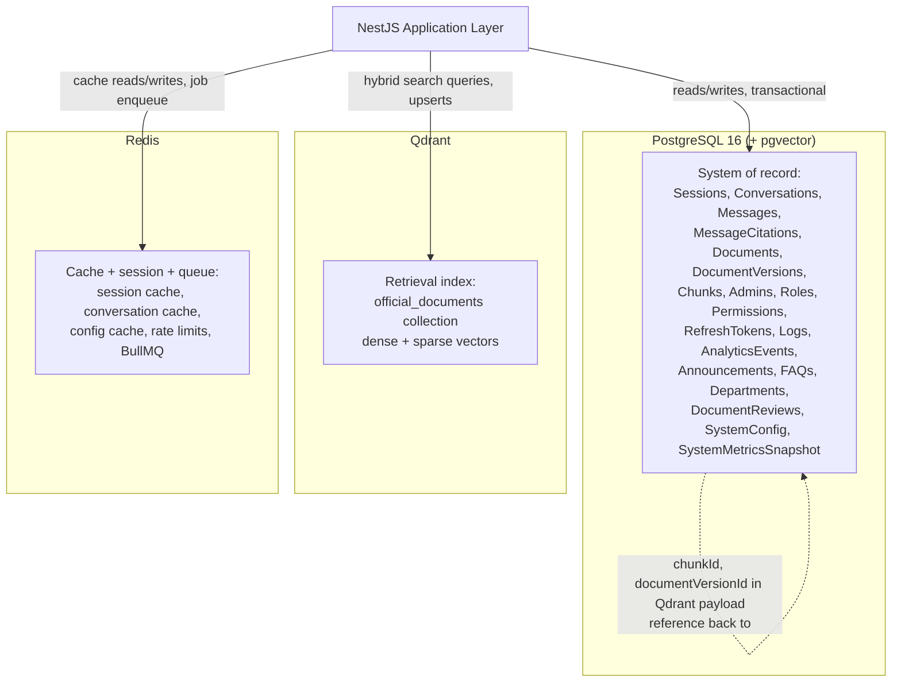
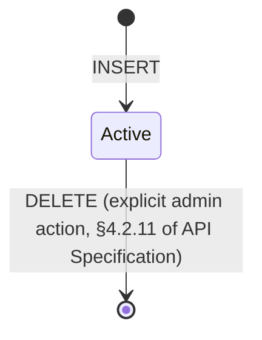
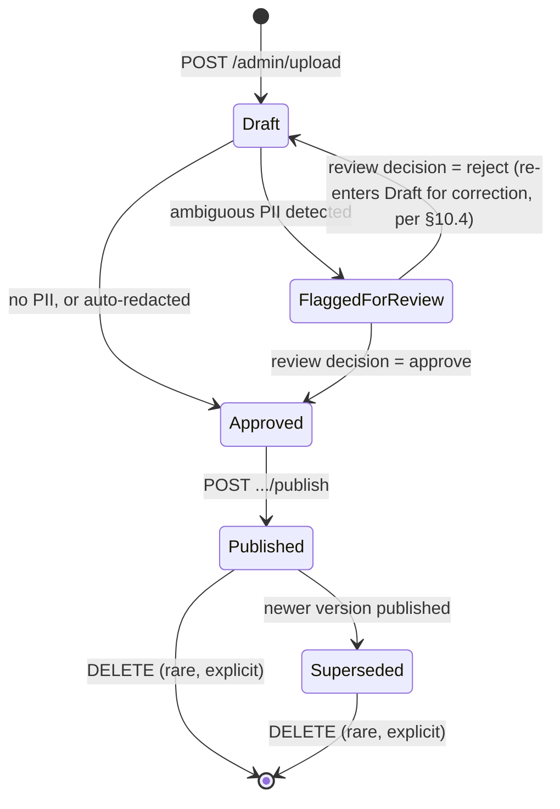
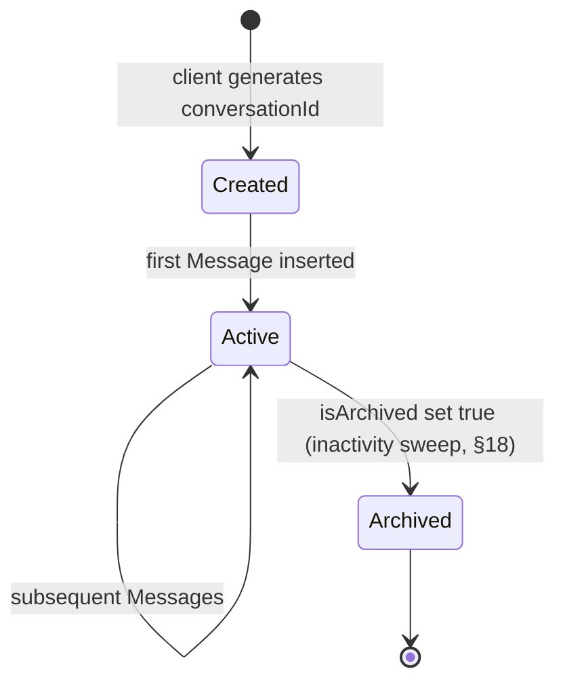
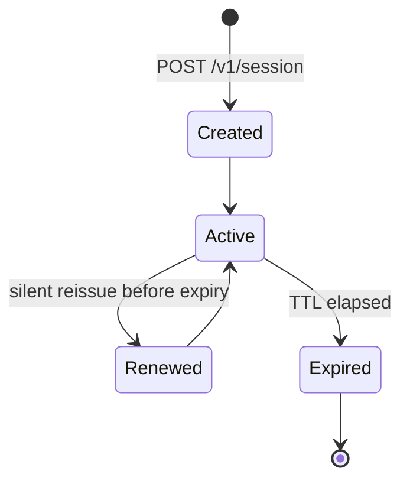
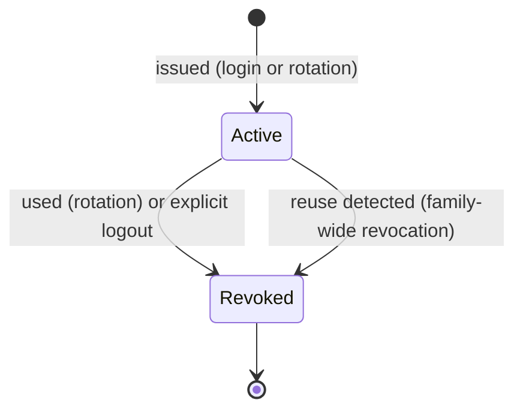
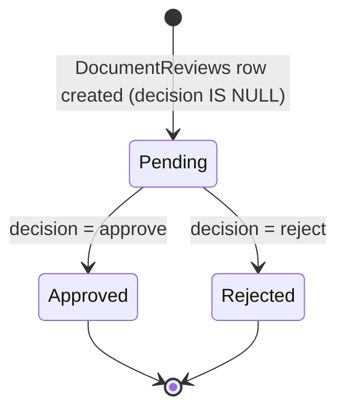
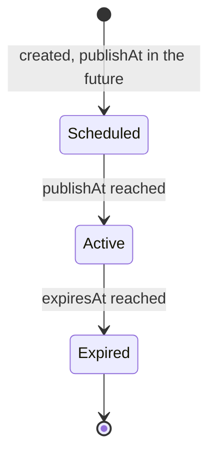
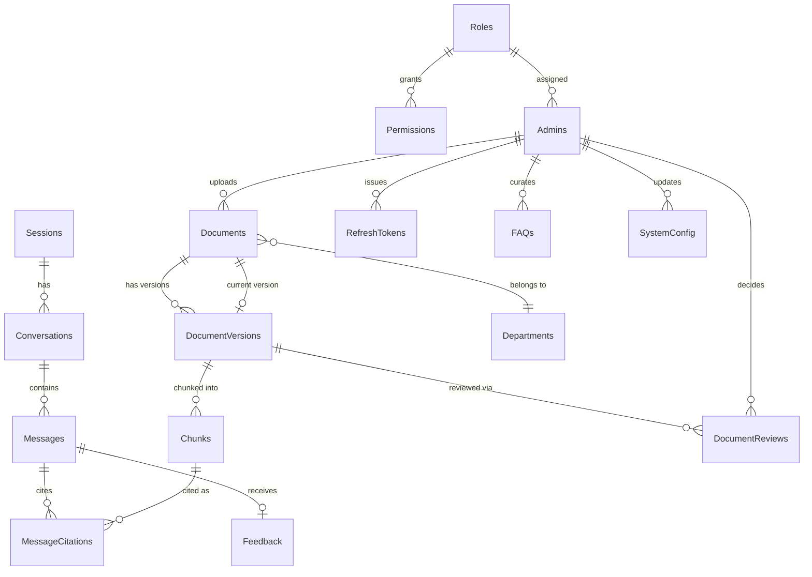
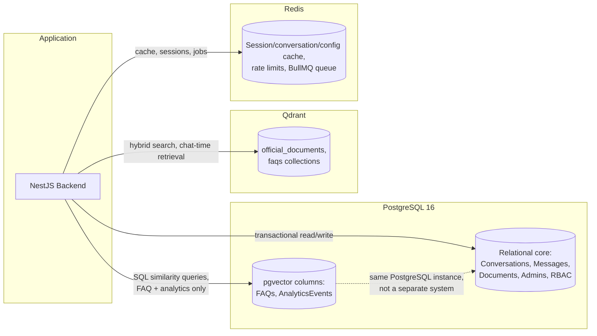

# GCE Tirunelveli AI Assistant — Database Design Document

**Derived strictly from:** Product Requirements Document, Conversation Design v2, Frontend Architecture v2, Backend Architecture v2, and API Specification v1. This document is the persistence layer for those systems only — it introduces no new product behavior, endpoint, workflow, or authorization model. Every table, relationship, index, or constraint not explicitly named in a prior document is added as the **smallest architecturally consistent addition** and marked `[NEW — assumption]` with a one-sentence justification. Where a prior document's own template *suggested* an entity that would actually contradict an already-approved decision, this document says so explicitly and omits it, rather than adding it silently (see §3.11, §4.4).

**Stack (fixed, not substituted):** PostgreSQL 16, the `pgvector` extension, Qdrant, Redis.

---

## 1. Introduction

### 1.1 Purpose
Specify the complete persistence layer — schema, indexes, constraints, state machines, and cross-store data flow — needed to implement the four approved architecture documents, in enough detail that a backend engineer can build the database without further design decisions.

### 1.2 Scope
Covers PostgreSQL schema, `pgvector` usage, Qdrant collection design, and Redis usage. Does not cover application business logic (Backend Architecture), request/response contracts (API Specification), or UI/conversational behavior — this document assumes those are fixed and asks only "where does the data implementing them live, and how is it shaped."

### 1.3 Database philosophy
Three systems, three distinct jobs, none of them redundant with each other:
- **PostgreSQL** is the system of record — anything that must be relationally consistent, transactionally safe, or queried by a human via SQL lives here.
- **Qdrant** is the retrieval index — chat-time hybrid dense+sparse semantic search over document chunks (Backend Architecture §5.5, §8). It is never a source of truth for content, only for ranking.
- **Redis** is the performance layer — caching, session storage, and queuing. Its failure degrades performance, never correctness (Backend Architecture §13).

### 1.4 Consistency rules
1. No fact the chatbot can state to a student exists only in Qdrant — every citation resolves back to a PostgreSQL row (`Documents`/`DocumentVersions`/`Chunks`), per API Specification §6.6's `MessageCitations` design.
2. No table in this document introduces a new authorization model, a new document state, or a new conversational behavior not already fixed upstream — see §3.11 and §4.4 for two places the requested entity list would have done exactly that, and why this document declines.
3. Every ID referenced across systems (a `Chunk.id`, a `DocumentVersion.id`) is the same UUID in PostgreSQL and in the corresponding Qdrant point's payload — there is no separate ID-mapping table, by design, since introducing one would be a second source of truth for something a shared UUID already solves for free.

### 1.5 ACID requirements
All PostgreSQL writes involved in a single logical operation (e.g., publishing a document version, which updates both the new and prior version's rows) are wrapped in a single transaction (§10) — partial writes are never acceptable for any state-machine transition in this system. Qdrant and Redis operations are **not** part of these transactions (neither supports multi-statement ACID transactions the way PostgreSQL does) — §2.5 and §10 specify the ordering discipline used instead to keep them consistent-enough without pretending they're transactional.

### 1.6 Normalization strategy
Third normal form (3NF) by default for every table in §5. The two deliberate departures, each justified individually rather than left implicit:
- `Logs.metadata` and `AnalyticsEvents.metadata` are JSONB, not further normalized — these are inherently variable-shape event payloads (Backend Architecture §14/§16), and normalizing them into rigid columns would require a schema migration for every new event field, which is worse than the query-flexibility cost of JSONB for this specific, append-only, rarely-joined data.
- `Chunks.chunkText` denormalizes (duplicates) a portion of `DocumentVersions.extractedText` — justified in §3.7, since re-deriving a chunk's text from stored offsets on every citation display would be needless recomputation of static data.

### 1.7 Database naming conventions
- **Tables:** `PascalCase`, plural nouns (`Messages`, `DocumentVersions`) — matches every table name already fixed in Backend Architecture §7.
- **Columns:** `camelCase`, quoted identifiers (`"conversationId"`, `"createdAt"`) — chosen specifically so a column name never needs translation to match its corresponding JSON field in API Specification §1.8; the ORM (Backend Architecture §2's NestJS/TypeORM choice) manages this quoting transparently.
- **Constraints/indexes:** `<table>_<columns>_<type>` (e.g., `messages_conversationid_createdat_idx`, `documents_contenthash_key`).

### 1.8 Primary key strategy
Every table's primary key is a UUID, generated via `gen_random_uuid()` (the `pgcrypto` extension, enabled once at database init) — matching API Specification §1.8/§13.4's UUIDv4 policy exactly, so no ID is ever translated between its database and wire representations.

### 1.9 UUID policy
UUIDv4, lowercase, hyphenated, stored as PostgreSQL's native `uuid` type (not `varchar`) — native `uuid` is 16 bytes fixed-width versus a 36-character string, meaningfully cheaper for the join-heavy access patterns this schema has (`Messages` → `MessageCitations` → `Documents`, etc.).

### 1.10 Timestamp policy
Every timestamp column is `timestamptz`, stored internally in UTC, rendered on the wire as ISO 8601 with a `Z` suffix — matching API Specification §1.8/§13.5 exactly. `timestamptz`, not `timestamp`, specifically because it stores an unambiguous instant regardless of the database server's or a future read replica's local timezone configuration.

### 1.11 Soft delete policy
Not a single blanket policy — the two rules already fixed upstream, stated together for clarity:
- **Documents/DocumentVersions:** soft-supersede is the default (`status` transitions to `Superseded`, never deleted), per Backend Architecture §8/§9. Hard deletion exists (`DELETE /admin/documents/{id}`, API Specification §4.2.11) but is an explicit, rare, audited admin action — never a routine consequence of publishing a new version.
- **Messages/Conversations/Feedback:** never deleted in the approved architecture at all — governed by the retention/archival policy in §18, not a delete flag. `Conversations.isArchived` (Backend Architecture §7) marks inactivity, not removal.

### 1.12 Versioning philosophy
Every versioned entity (`DocumentVersions`) carries an explicit, monotonically increasing `versionNumber` and a single lifecycle `status` enum — never a boolean flag alongside a separate status field, per the consolidation already fixed in Backend Architecture v2 §7's note on avoiding "the redundant, driftable dual-flag problem."

---

## 2. Database Architecture

### 2.1 Overall architecture



### 2.2 PostgreSQL responsibilities
Every entity in §3 — conversations, messages, citations, documents and their versions, chunk metadata, admin/RBAC, audit logs, analytics, and configuration. If a fact needs to be joined, constrained, audited, or queried relationally, it lives here — not in Qdrant, not in Redis.

### 2.3 Qdrant responsibilities
Exactly what Backend Architecture §8 already fixed: one primary collection (`official_documents`) holding dense + sparse vectors per chunk, plus the smaller `faqs` collection as a fast-path — nothing added or changed here. Qdrant never stores chunk text as its authoritative copy; the payload carries only the `documentId`/`documentVersionId`/`chunkId` needed to join back to PostgreSQL, plus the filtering metadata (department, documentType, isActive) already specified.

### 2.4 Redis responsibilities
Session cache, conversation-history cache, popular-answer cache, rate-limit counters, and the BullMQ queue backend — exactly the five uses already fixed in Backend Architecture §11, with concrete key/TTL design in §7 of this document.

### 2.5 How they communicate — and the ordering discipline that keeps them consistent without shared transactions
Since Qdrant/Redis operations cannot join a PostgreSQL transaction, this system uses a strict **write-order discipline** instead:
1. A `DocumentVersion`'s PostgreSQL row is always written (status transition) **before** its corresponding Qdrant points are upserted/flagged — so a crash between the two steps leaves the *worse* of the two possible inconsistent states (a `Published` row whose vectors aren't indexed yet, correctly answered as "not found" by retrieval) rather than the *dangerous* one (retrievable, citable vectors for a row that was never actually approved).
2. Deleting/deactivating Qdrant points happens **before** the PostgreSQL row is marked `Superseded`/deleted, for the same reason in reverse — a citation must never be able to resolve to a PostgreSQL row that Qdrant would also still happily serve as current.
3. Both orderings resolve to the same principle: **when the two systems can briefly disagree, they must disagree in the direction of under-serving, never over-serving** — this is the persistence-layer expression of Backend Architecture §13's "fail closed" rule for retrieval.

### 2.6 Persistence boundaries
- A chat answer's *content* (message text, citations, confidence/groundedness scores) is PostgreSQL's job the moment `POST /v1/chat` completes (API Specification §4.1.2) — Qdrant and Redis have no persistence role in an individual answer once it's delivered.
- A document's *retrievability* is Qdrant's job; its *lifecycle, audit trail, and text* are PostgreSQL's.
- Nothing is ever the "cache of record" — if Redis is flushed entirely, the system degrades in performance (§7) but loses no data that PostgreSQL didn't already own.

### 2.7 Read/write flow (chat request)
Matches Backend Architecture §1.3 exactly, shown here from the data layer's perspective:
```
Read:  Redis (conversation history cache) --miss--> PostgreSQL (Messages)
Read:  Qdrant (hybrid search) — never PostgreSQL for retrieval ranking
Write: PostgreSQL (Messages, MessageCitations) — only after both hallucination gates pass
Write: Redis (updated conversation history cache) — after the PostgreSQL write, never before
```

### 2.8 Transaction boundaries
See §10 for each named transaction. The governing rule: a transaction's boundary is exactly one state-machine transition (or one atomic multi-row write implementing it) — never spans a network call to Qdrant, Redis, the AI Orchestrator, or the LLM Gateway, all of which sit outside any PostgreSQL transaction by construction.

---

## 3. Entity Relationship Design

Only entities actually required by the approved architecture are included. Two entities suggested by the prompt template are deliberately **not** included — see §3.11.

### 3.1 Sessions
**Purpose:** Anonymous student session identity, per Conversation Design v2 (no login required) and API Specification §2.1/§4.1.1.
| Field | Type | Notes |
|---|---|---|
| `id` | `uuid` (PK) | |
| `tokenHash` | `text` | SHA-256 hash of the session cookie value — the raw token is never stored |
| `createdAt` | `timestamptz` | |
| `expiresAt` | `timestamptz` | |
| `ipHash` | `text`, nullable | Hashed, not raw, per §13's data-minimization stance |
**Foreign keys:** none (referenced by `Conversations`).
**Unique constraints:** `tokenHash`.
**Indexes:** `sessions_tokenhash_key` (unique), `sessions_expiresat_idx` (for expiry sweeps, §7).
**Validation/business rules:** `expiresAt` must be after `createdAt`; a session is never updated in place except `expiresAt` on silent renewal (API Specification §2.4).

### 3.2 Conversations
**Purpose:** Groups messages into one chat thread. Matches Backend Architecture §7 and its `isArchived` field exactly (used by the conversation-lifecycle state machine, §11.3).
| Field | Type | Notes |
|---|---|---|
| `id` | `uuid` (PK) | Client-generated per API Specification §4.1.2, not server-generated — the only ID in this schema created client-side, noted explicitly since it's an exception to the general pattern |
| `sessionId` | `uuid` (FK → Sessions) | |
| `startedAt` | `timestamptz` | |
| `lastActivityAt` | `timestamptz` | |
| `isArchived` | `boolean`, default `false` | |
**Indexes:** `conversations_sessionid_idx`, `conversations_lastactivityat_idx` (drives the archival sweep, §18).
**Business rules:** `lastActivityAt` updated on every new `Message` insert, never on read.

### 3.3 Messages
**Purpose:** One turn (user or assistant) in a conversation. Matches Backend Architecture §7 (post-normalization revision) exactly.
| Field | Type | Notes |
|---|---|---|
| `id` | `uuid` (PK) | |
| `conversationId` | `uuid` (FK → Conversations) | |
| `role` | `text` (check: `'user'` \| `'assistant'`) | |
| `content` | `text` | |
| `componentType` | `text`, nullable | `'resp-card'` \| `'img-gallery'` \| `'pdf-chip'` \| `'source-line'` \| `'verified-badge'` \| `null` — matches the Frontend Architecture §5.2 chunk contract exactly |
| `retrievalConfidenceScore` | `real`, nullable | Assistant messages only |
| `groundednessResult` | `text`, nullable, check: `'pass'` \| `null` | Deliberately never stores `'fail'` — a failed groundedness check is never persisted as a delivered message (API Specification §4.1.3's business rule) |
| `latencyMs` | `integer`, nullable | |
| `createdAt` | `timestamptz` | |
**Indexes:** `messages_conversationid_createdat_idx` (composite — the hot path for history fetch, Backend Architecture §5.2/API Specification §4.1.3), partial index `messages_role_assistant_idx ON Messages (conversationId) WHERE role = 'assistant'` for confidence/groundedness analytics queries that never need user-role rows.
**Business rules:** immutable once written — no `UPDATE` statement in the application ever targets an existing `Message` row (an edit is a new message, matching the conversational model's turn-based nature).

### 3.4 MessageCitations
**Purpose:** Normalized citation join table, replacing the earlier array-column design — fixed exactly as specified in Backend Architecture v2 §7 and API Specification §6.6.
| Field | Type | Notes |
|---|---|---|
| `id` | `uuid` (PK) | |
| `messageId` | `uuid` (FK → Messages) | |
| `documentId` | `uuid` (FK → Documents) | |
| `documentVersionId` | `uuid` (FK → DocumentVersions) | The version current *at generation time* — resolves historical auditability even after a later supersession |
| `chunkId` | `uuid` (FK → Chunks) | See §3.7 — this is the field that required `Chunks` to exist as a real table rather than a bare string |
| `relevanceScore` | `real` | |
| `createdAt` | `timestamptz` | |
**Indexes:** `messagecitations_messageid_idx`, `messagecitations_documentid_idx` (powers "which messages cite document X," the exact query the original array-column design couldn't serve well).
**Business rules:** one row per citation — a message with three citations has three rows (Backend Architecture v2 §7).

### 3.5 Feedback
**Purpose:** The `.like-btn` signal, per Frontend Architecture §3 and API Specification §4.1.4.
| Field | Type | Notes |
|---|---|---|
| `id` | `uuid` (PK) | |
| `messageId` | `uuid` (FK → Messages) | |
| `isHelpful` | `boolean` | |
| `freeText` | `varchar(500)`, nullable | |
| `createdAt` | `timestamptz` | |
| `updatedAt` | `timestamptz` | Set on resubmission — API Specification §4.1.4's business rule ("a resubmission updates the existing row") requires this column even though the prior documents didn't spell it out — `[NEW — assumption]`: needed to actually implement "update the existing row" without losing when that update happened |
**Unique constraints:** `(messageId)` — enforces the "one feedback row per message" rule structurally, not just in application code.

### 3.6 Documents
**Purpose:** The stable identity of an official document across all its versions. Matches Backend Architecture §7 exactly.
| Field | Type | Notes |
|---|---|---|
| `id` | `uuid` (PK) | |
| `title` | `text` | |
| `department` | `text`, nullable (FK → Departments.code, see §3.10) | |
| `documentType` | `text` | e.g. `fee-structure`, `circular`, `policy` |
| `storageUrl` | `text` | Object storage reference, not the file itself |
| `currentVersionId` | `uuid`, nullable (FK → DocumentVersions) | Nullable because a brand-new `Documents` row is created before its first `DocumentVersion` exists (API Specification §4.2.4's create-then-process flow) |
| `isActive` | `boolean`, default `true` | `false` only after a hard `DELETE` marks the parent row itself inactive prior to physical removal (see §9's deletion sequencing) |
| `uploadedBy` | `uuid` (FK → Admins) | |
| `createdAt` | `timestamptz` | |
**Indexes:** `documents_department_documenttype_idx` (composite, powers `GET /v1/documents`'s filter parameters, API Specification §4.1.5).

### 3.7 Chunks `[NEW — assumption]`
**Why necessary:** `MessageCitations.chunkId` (Backend Architecture v2 §7, API Specification §6.6) references a chunk, but no prior document ever defined where a chunk record actually lives as a queryable, foreign-key-constrainable row — without this table, `chunkId` would be an unconstrained free-text field, which contradicts this document's own normalization mandate and Backend Architecture's general "real foreign keys, not loose references" philosophy (the same argument that justified `MessageCitations` itself over an array column).
**Purpose:** The PostgreSQL-side record of one retrievable unit of a document version — the relational anchor a citation actually points to, and the bridge to its corresponding Qdrant point.
| Field | Type | Notes |
|---|---|---|
| `id` | `uuid` (PK) | Same UUID as the corresponding Qdrant point's payload `chunkId` (§1.4, rule 3) |
| `documentVersionId` | `uuid` (FK → DocumentVersions) | |
| `sequenceNumber` | `integer` | Position within the document, for ordered reconstruction if ever needed |
| `chunkText` | `text` | Denormalized copy of this chunk's text (§1.6) — avoids re-deriving it from `DocumentVersions.extractedText` offsets on every citation display |
| `tokenCount` | `integer` | |
| `embeddingModelVersion` | `text` | Must match the model version used at query time (Backend Architecture §5.5's non-negotiable consistency rule) — stored here, not only in Qdrant, so a model migration can be detected via a simple SQL query rather than a Qdrant scan |
| `qdrantPointId` | `uuid` | The point ID in the `official_documents` collection carrying this chunk's dense + sparse vectors (§6) |
| `createdAt` | `timestamptz` | |
**Indexes:** `chunks_documentversionid_idx`.
**Business rules:** `Chunks` rows are **never** deleted on supersession — matching `DocumentVersions`' own soft-supersede policy (§1.11), since a `MessageCitations` row from a past answer must still resolve.

### 3.8 DocumentVersions
**Purpose:** One version of a document's content and lifecycle state. Matches Backend Architecture v2 §7/§9 exactly, including the consolidated `status` state machine.
| Field | Type | Notes |
|---|---|---|
| `id` | `uuid` (PK) | |
| `documentId` | `uuid` (FK → Documents) | |
| `versionNumber` | `integer` | |
| `extractedText` | `text` | Full cleaned text, pre-chunking |
| `contentHash` | `text` | SHA-256 of cleaned, post-redaction text (Backend Architecture §9's duplicate-detection rule) |
| `status` | `text`, check: `'Draft'` \| `'FlaggedForReview'` \| `'Approved'` \| `'Published'` \| `'Superseded'` | Single consolidated state column (Backend Architecture v2 §7) |
| `piiReviewedBy` | `uuid`, nullable (FK → Admins) | |
| `indexedAt` | `timestamptz`, nullable | Set only once chunking/embedding (§6) completes |
| `createdAt` | `timestamptz` | |
**Unique constraints:** `(documentId, versionNumber)`.
**Indexes:** `documentversions_documentid_status_idx` (composite — powers both `GET .../versions` and the review-queue query, API Specification §4.2.7/§4.2.8).
**Check constraint:** `versionNumber > 0`.

### 3.9 DocumentReviews `[NEW — assumption]`
**Why necessary:** `DocumentVersions.status = 'FlaggedForReview'` records *that* a version is flagged, but not *why*, nor the eventual decision's audit trail (who decided, when, what was changed) — API Specification §4.2.8/§4.2.9 requires exposing a `flaggedReason` and recording a `decision`, which have nowhere to live without either bloating `DocumentVersions` with columns that are `null` for the vast majority of versions that are never flagged, or a dedicated table. A dedicated table is the more normalized choice, consistent with this document's 3NF mandate (§1.6).
**Purpose:** The PII-review workflow's audit record — one row per flagging event.
| Field | Type | Notes |
|---|---|---|
| `id` | `uuid` (PK) | |
| `documentVersionId` | `uuid` (FK → DocumentVersions) | |
| `flaggedReason` | `text` | e.g. "Ambiguous name-shaped entity detected outside expected contact context" |
| `flaggedAt` | `timestamptz` | |
| `decision` | `text`, nullable, check: `'approve'` \| `'reject'` \| `null` | `null` while still pending |
| `decidedBy` | `uuid`, nullable (FK → Admins) | |
| `decidedAt` | `timestamptz`, nullable | |
| `redactedText` | `text`, nullable | If the admin manually edited the text during review (API Specification §4.2.9) |
**Business rules:** a `DocumentVersion` can have more than one `DocumentReviews` row over its lifetime only if it's re-flagged after a correction — the review queue (§4.2.8) reads the most recent row with `decision IS NULL`.

### 3.10 Departments
**Purpose:** Referenced by `Documents`, `FAQs` (as category filters). Matches Backend Architecture §7.
| Field | Type | Notes |
|---|---|---|
| `id` | `uuid` (PK) | |
| `code` | `text` | e.g. `EEE`, `CSE` |
| `name` | `text` | |
| `hodName` | `text`, nullable | |
| `contactEmail` | `text`, nullable | |
**Unique constraints:** `code`.

### 3.11 On "Admin Permission" and "Role Permission" — deliberately not included
The template's suggested entity list includes both. Neither is added, and here is why, stated explicitly rather than silently omitted:
- **RolePermission** (implying a many-to-many Role↔Permission relationship) is **not** included, because Backend Architecture §7 already fixed `Permissions.roleId` as a direct one-to-many relationship (one `Permissions` row belongs to exactly one `Role`). Introducing a many-to-many join table now would mean permissions could be shared across multiple roles — a genuinely different authorization model than what's approved, not a persistence-layer detail. If that flexibility is wanted later, it's an architecture decision for Backend Architecture to make first, not something this document should introduce unilaterally.
- **AdminPermission** (implying per-admin permission overrides, distinct from the admin's role) is **not** included, because Backend Architecture §10's RBAC model is explicitly role-based only — an admin's permissions come entirely from their assigned `Role`. Adding a per-admin override table would let an individual admin's permissions diverge from their role, which is a new authorization capability, not a database table implementing an existing one.

### 3.12 Roles
| Field | Type | Notes |
|---|---|---|
| `id` | `uuid` (PK) | |
| `name` | `text` | e.g. `SuperAdmin`, `ContentEditor`, `Viewer` |
**Unique constraints:** `name`.

### 3.13 Permissions
**Purpose:** Resource+action pairs, each belonging to exactly one role (§3.11).
| Field | Type | Notes |
|---|---|---|
| `id` | `uuid` (PK) | |
| `roleId` | `uuid` (FK → Roles) | |
| `resource` | `text` | e.g. `documents`, `analytics`, `config` |
| `action` | `text` | e.g. `read`, `write`, `publish`, `delete`, `review` — matches every permission string already used throughout API Specification §4.2 (`documents:write`, `documents:publish`, `documents:review`, `documents:delete`, etc.) |
**Unique constraints:** `(roleId, resource, action)`.
**Indexes:** `permissions_roleid_idx`.

### 3.14 Admins
**Purpose:** Matches Backend Architecture v2 §7 exactly, including the MFA columns added in that revision.
| Field | Type | Notes |
|---|---|---|
| `id` | `uuid` (PK) | |
| `email` | `text` | |
| `passwordHash` | `text` | bcrypt/argon2 (§13) |
| `roleId` | `uuid` (FK → Roles) | |
| `mfaEnabled` | `boolean`, default `false` | Application-enforced as always effectively `true` before first successful login completes (Backend Architecture v2 §10's "no opt-out") — the column still exists to represent the brief window during initial account provisioning before MFA enrollment finishes |
| `mfaSecret` | `text`, nullable | Encrypted at rest (§13) |
| `isActive` | `boolean`, default `true` | |
| `lastLoginAt` | `timestamptz`, nullable | |
| `createdAt` | `timestamptz` | |
**Unique constraints:** `email`.

### 3.15 RefreshTokens
**Purpose:** Matches Backend Architecture §7/§10 exactly.
| Field | Type | Notes |
|---|---|---|
| `id` | `uuid` (PK) | |
| `adminId` | `uuid` (FK → Admins) | |
| `tokenHash` | `text` | |
| `expiresAt` | `timestamptz` | |
| `revokedAt` | `timestamptz`, nullable | Set on rotation (immediate, every use) or explicit logout |
| `createdAt` | `timestamptz` | |
**Indexes:** `refreshtokens_tokenhash_idx`, `refreshtokens_adminid_revokedat_idx` (powers "revoke entire token family" on reuse detection, Backend Architecture v2 §10).

### 3.16 Announcements
| Field | Type | Notes |
|---|---|---|
| `id` | `uuid` (PK) | |
| `title` | `text` | |
| `body` | `text` | |
| `publishAt` | `timestamptz` | |
| `expiresAt` | `timestamptz` | |
| `priority` | `text`, check: `'low'` \| `'normal'` \| `'high'` | |
| `isActive` | `boolean` | Computed/maintained by the Announcement Sync worker (Backend Architecture §16), not derived at query time, so a query never needs to compare against `now()` to know the current active set |
**Check constraint:** `expiresAt > publishAt`.

### 3.17 FAQs
**Purpose:** Curated fast-path retrieval source (Backend Architecture §6/§8). Extended here with a `pgvector` embedding column — see §6.7 for why.
| Field | Type | Notes |
|---|---|---|
| `id` | `uuid` (PK) | |
| `question` | `text` | |
| `answer` | `text` | |
| `category` | `text`, nullable | |
| `isActive` | `boolean`, default `true` | |
| `curatedBy` | `uuid` (FK → Admins) | |
| `questionEmbedding` | `vector(1536)` | `pgvector` column — `[NEW — assumption]`, justified fully in §6.7 |
| `updatedAt` | `timestamptz` | |
**Indexes:** `faqs_questionembedding_idx` (`ivfflat`, see §8.5).

### 3.18 Logs
**Purpose:** Structured application logs (Backend Architecture §14). Partitioned — see §15.1.
| Field | Type | Notes |
|---|---|---|
| `id` | `uuid` (PK) | |
| `correlationId` | `uuid` | |
| `level` | `text`, check: `'debug'` \| `'info'` \| `'warn'` \| `'error'` | |
| `message` | `text` | |
| `metadata` | `jsonb` | |
| `createdAt` | `timestamptz` | Partition key |
**Indexes:** `logs_correlationid_idx`, GIN index on `metadata` (§8.3) for structured-field search within a log entry.

### 3.19 AnalyticsEvents
**Purpose:** Backend Architecture §7/§16 — kept separate from `Logs` deliberately, different retention (§18) and access pattern (aggregation, not per-request debugging).
| Field | Type | Notes |
|---|---|---|
| `id` | `uuid` (PK) | |
| `eventType` | `text` | |
| `conversationId` | `uuid`, nullable (FK → Conversations) | |
| `metadata` | `jsonb` | |
| `questionEmbedding` | `vector(1536)`, nullable | `pgvector` column, populated only for `eventType = 'unanswered-question'` — §6.7 |
| `createdAt` | `timestamptz` | |
**Indexes:** `analyticsevents_eventtype_createdat_idx`, `analyticsevents_questionembedding_idx` (`ivfflat`, partial — see §8.5/§8.7).

### 3.20 SystemConfig `[NEW — assumption]`
**Why necessary:** API Specification §4.2.17 (`GET`/`PATCH /admin/config`) exposes `retrievalTopK`, `rerankTopN`, `confidenceThreshold` — these values must persist somewhere durable and auditable; no prior document names a table for them.
**Purpose:** Key-value store for the small set of admin-tunable retrieval parameters — key-value, not fixed columns, so a future additional tunable is a row insert, not a migration.
| Field | Type | Notes |
|---|---|---|
| `key` | `text` (PK) | e.g. `retrievalTopK`, `rerankTopN`, `confidenceThreshold` |
| `value` | `jsonb` | Holds the typed value (number, string, etc.) |
| `updatedAt` | `timestamptz` | |
| `updatedBy` | `uuid` (FK → Admins) | |
**Business rules:** changes take effect for new requests only (API Specification §4.2.17) — the application layer, not this table, enforces that; the table itself has no versioning of past values beyond what `Logs`/audit logging (§12) already captures for the `PATCH` action.

### 3.21 SystemMetricsSnapshot `[NEW — assumption]`
**Why necessary:** `GET /admin/dashboard` and `GET /admin/analytics` (API Specification §4.2.14/§4.2.16) need fast aggregate numbers (conversations today, documents published, positive-feedback rate); computing these live from `Messages`/`Conversations`/`Feedback` on every request would mean full-table scans against growing, high-volume tables for a dashboard landing page. A periodic rollup table is standard practice for exactly this access pattern.
**Purpose:** Hourly aggregate snapshots, written by a scheduled worker (Backend Architecture §16-style background job), read by the admin dashboard/analytics endpoints instead of scanning raw tables.
| Field | Type | Notes |
|---|---|---|
| `id` | `uuid` (PK) | |
| `snapshotAt` | `timestamptz` | Truncated to the hour |
| `conversationsCount` | `integer` | |
| `messagesCount` | `integer` | |
| `noDataRate` | `real` | |
| `groundednessFailureRate` | `real` | |
| `positiveFeedbackRate` | `real` | |
**Unique constraints:** `snapshotAt`.
**Business rules:** never updated in place — a re-run for the same hour inserts a corrected row and the application reads the latest by `snapshotAt`, preserving an audit trail of any correction rather than silently overwriting history.

---

## 4. Relationships

### 4.1 One-to-one
- `Documents.currentVersionId` → `DocumentVersions.id` — one document has exactly one *current* version pointer, even though it has many historical versions (one-to-many, below); this specific pointer is one-to-one.

### 4.2 One-to-many
| Parent | Child | Notes |
|---|---|---|
| `Sessions` → `Conversations` | One session, many conversations | |
| `Conversations` → `Messages` | | |
| `Messages` → `MessageCitations` | One message can cite several chunks | |
| `Messages` → `Feedback` | Constrained to *at most* one by the unique constraint (§3.5) — structurally one-to-one-or-zero in practice, modeled as one-to-many at the schema level since nothing prevents it structurally except the unique key |
| `Documents` → `DocumentVersions` | Full version history | |
| `DocumentVersions` → `Chunks` | | |
| `DocumentVersions` → `DocumentReviews` | Usually zero or one row; more than one only on re-flagging | |
| `Roles` → `Permissions` | Confirmed as one-to-many, not many-to-many — §3.11 | |
| `Roles` → `Admins` | | |
| `Admins` → `RefreshTokens` | | |
| `Admins` → `Documents` (`uploadedBy`) | | |
| `Admins` → `DocumentReviews` (`decidedBy`) | | |

### 4.3 Many-to-many
**None exist in this schema.** Every relationship that might initially look many-to-many (Documents↔Departments, for instance) resolves to one-to-many once modeled correctly (`Documents.department` is a plain foreign key to one `Departments.code` — a document belongs to one department, matching Backend Architecture's own document metadata model). This is stated explicitly because the template's entity list (`RolePermission`) implied one that §3.11 explains is deliberately not part of this design.

### 4.4 Cascade rules
| Relationship | On parent delete |
|---|---|
| `Conversations` → `Messages` | `RESTRICT` — conversations are never deleted (§1.11), so this is a defensive constraint, not an expected code path |
| `Messages` → `MessageCitations`, `Feedback` | `CASCADE` — these have no independent meaning without their parent message, and messages are themselves never deleted, so this only ever matters in test/staging data cleanup |
| `Documents` → `DocumentVersions` | `RESTRICT` — a hard document delete (§4.2.11) must explicitly and deliberately remove versions first (§9), never as an automatic cascade side-effect, given how consequential removing indexed content is |
| `DocumentVersions` → `Chunks`, `DocumentReviews` | `RESTRICT`, same reasoning |
| `Admins` → `RefreshTokens` | `CASCADE` — a deactivated admin's tokens are meaningless without the admin row |
| `Roles` → `Permissions` | `RESTRICT` — a role with active admins assigned cannot be deleted out from under them; deleting a role's permissions must be a deliberate, separate action |

### 4.5 Deletion behavior
Summarized from §1.11/§4.4: soft-supersede is the default for content; hard delete is `RESTRICT`-guarded and multi-step (§9); operational entities (`Messages`, `Conversations`, `Feedback`) are never deleted by the application, only archived/retained per policy (§18).

### 4.6 Versioning relationships
`Documents.currentVersionId` always points at the row with `status = 'Published'` for that document (enforced by application logic at publish time, not a database trigger — see §9 for why a trigger was deliberately not used here) — never at a `Draft`, `FlaggedForReview`, or `Superseded` row.

### 4.7 Conversation hierarchy
`Sessions` → `Conversations` → `Messages` → (`MessageCitations` | `Feedback`) — a strict three-level hierarchy, no cross-links (a `Message` never belongs to more than one `Conversation`, matching the conversational model's linear turn-taking).

### 4.8 Document hierarchy
`Departments` (referenced) ← `Documents` → `DocumentVersions` → (`Chunks` | `DocumentReviews`) — and `Chunks`/`MessageCitations` are the two tables that reach back out of this hierarchy into the conversation hierarchy (§4.7), the single point where the two object graphs connect.

### 4.9 Permission hierarchy
`Roles` → `Permissions`, `Roles` → `Admins` — a flat, two-level hierarchy by design (§3.11), not a nested role-inheritance tree, since Backend Architecture never specified role inheritance and this document doesn't introduce it.

---

## 5. PostgreSQL Schema

Full column-level definitions for every table in §3, in one place for direct implementation. (Types, nullability, defaults, and constraints already stated per-table in §3 are not repeated in full prose here — this section is the DDL-adjacent reference; §3 is the narrative one.)

```sql
-- Extensions
CREATE EXTENSION IF NOT EXISTS pgcrypto;
CREATE EXTENSION IF NOT EXISTS vector;

CREATE TABLE "Sessions" (
  "id" uuid PRIMARY KEY DEFAULT gen_random_uuid(),
  "tokenHash" text NOT NULL UNIQUE,
  "createdAt" timestamptz NOT NULL DEFAULT now(),
  "expiresAt" timestamptz NOT NULL,
  "ipHash" text,
  CONSTRAINT sessions_expiresat_check CHECK ("expiresAt" > "createdAt")
);

CREATE TABLE "Conversations" (
  "id" uuid PRIMARY KEY,  -- client-generated, §3.2
  "sessionId" uuid NOT NULL REFERENCES "Sessions"("id") ON DELETE RESTRICT,
  "startedAt" timestamptz NOT NULL DEFAULT now(),
  "lastActivityAt" timestamptz NOT NULL DEFAULT now(),
  "isArchived" boolean NOT NULL DEFAULT false
);

CREATE TABLE "Messages" (
  "id" uuid PRIMARY KEY DEFAULT gen_random_uuid(),
  "conversationId" uuid NOT NULL REFERENCES "Conversations"("id") ON DELETE RESTRICT,
  "role" text NOT NULL CHECK ("role" IN ('user','assistant')),
  "content" text NOT NULL,
  "componentType" text CHECK ("componentType" IN ('resp-card','img-gallery','pdf-chip','source-line','verified-badge')),
  "retrievalConfidenceScore" real,
  "groundednessResult" text CHECK ("groundednessResult" IN ('pass')),
  "latencyMs" integer,
  "createdAt" timestamptz NOT NULL DEFAULT now()
);

CREATE TABLE "Documents" (
  "id" uuid PRIMARY KEY DEFAULT gen_random_uuid(),
  "title" text NOT NULL,
  "department" text REFERENCES "Departments"("code"),
  "documentType" text NOT NULL,
  "storageUrl" text NOT NULL,
  "currentVersionId" uuid,
  "isActive" boolean NOT NULL DEFAULT true,
  "uploadedBy" uuid NOT NULL REFERENCES "Admins"("id"),
  "createdAt" timestamptz NOT NULL DEFAULT now()
);

CREATE TABLE "DocumentVersions" (
  "id" uuid PRIMARY KEY DEFAULT gen_random_uuid(),
  "documentId" uuid NOT NULL REFERENCES "Documents"("id") ON DELETE RESTRICT,
  "versionNumber" integer NOT NULL CHECK ("versionNumber" > 0),
  "extractedText" text NOT NULL,
  "contentHash" text NOT NULL,
  "status" text NOT NULL CHECK ("status" IN ('Draft','FlaggedForReview','Approved','Published','Superseded')),
  "piiReviewedBy" uuid REFERENCES "Admins"("id"),
  "indexedAt" timestamptz,
  "createdAt" timestamptz NOT NULL DEFAULT now(),
  UNIQUE ("documentId", "versionNumber")
);

ALTER TABLE "Documents" ADD CONSTRAINT documents_currentversion_fk
  FOREIGN KEY ("currentVersionId") REFERENCES "DocumentVersions"("id");
  -- added after DocumentVersions exists, to resolve the circular reference cleanly

CREATE TABLE "Chunks" (
  "id" uuid PRIMARY KEY DEFAULT gen_random_uuid(),
  "documentVersionId" uuid NOT NULL REFERENCES "DocumentVersions"("id") ON DELETE RESTRICT,
  "sequenceNumber" integer NOT NULL,
  "chunkText" text NOT NULL,
  "tokenCount" integer NOT NULL,
  "embeddingModelVersion" text NOT NULL,
  "qdrantPointId" uuid NOT NULL,
  "createdAt" timestamptz NOT NULL DEFAULT now()
);

CREATE TABLE "MessageCitations" (
  "id" uuid PRIMARY KEY DEFAULT gen_random_uuid(),
  "messageId" uuid NOT NULL REFERENCES "Messages"("id") ON DELETE CASCADE,
  "documentId" uuid NOT NULL REFERENCES "Documents"("id"),
  "documentVersionId" uuid NOT NULL REFERENCES "DocumentVersions"("id"),
  "chunkId" uuid NOT NULL REFERENCES "Chunks"("id"),
  "relevanceScore" real NOT NULL,
  "createdAt" timestamptz NOT NULL DEFAULT now()
);

CREATE TABLE "DocumentReviews" (
  "id" uuid PRIMARY KEY DEFAULT gen_random_uuid(),
  "documentVersionId" uuid NOT NULL REFERENCES "DocumentVersions"("id") ON DELETE RESTRICT,
  "flaggedReason" text NOT NULL,
  "flaggedAt" timestamptz NOT NULL DEFAULT now(),
  "decision" text CHECK ("decision" IN ('approve','reject')),
  "decidedBy" uuid REFERENCES "Admins"("id"),
  "decidedAt" timestamptz,
  "redactedText" text
);

CREATE TABLE "Feedback" (
  "id" uuid PRIMARY KEY DEFAULT gen_random_uuid(),
  "messageId" uuid NOT NULL REFERENCES "Messages"("id") ON DELETE CASCADE UNIQUE,
  "isHelpful" boolean NOT NULL,
  "freeText" varchar(500),
  "createdAt" timestamptz NOT NULL DEFAULT now(),
  "updatedAt" timestamptz NOT NULL DEFAULT now()
);

CREATE TABLE "Departments" (
  "id" uuid PRIMARY KEY DEFAULT gen_random_uuid(),
  "code" text NOT NULL UNIQUE,
  "name" text NOT NULL,
  "hodName" text,
  "contactEmail" text
);

CREATE TABLE "Roles" (
  "id" uuid PRIMARY KEY DEFAULT gen_random_uuid(),
  "name" text NOT NULL UNIQUE
);

CREATE TABLE "Permissions" (
  "id" uuid PRIMARY KEY DEFAULT gen_random_uuid(),
  "roleId" uuid NOT NULL REFERENCES "Roles"("id") ON DELETE RESTRICT,
  "resource" text NOT NULL,
  "action" text NOT NULL,
  UNIQUE ("roleId", "resource", "action")
);

CREATE TABLE "Admins" (
  "id" uuid PRIMARY KEY DEFAULT gen_random_uuid(),
  "email" text NOT NULL UNIQUE,
  "passwordHash" text NOT NULL,
  "roleId" uuid NOT NULL REFERENCES "Roles"("id"),
  "mfaEnabled" boolean NOT NULL DEFAULT false,
  "mfaSecret" text,
  "isActive" boolean NOT NULL DEFAULT true,
  "lastLoginAt" timestamptz,
  "createdAt" timestamptz NOT NULL DEFAULT now()
);

CREATE TABLE "RefreshTokens" (
  "id" uuid PRIMARY KEY DEFAULT gen_random_uuid(),
  "adminId" uuid NOT NULL REFERENCES "Admins"("id") ON DELETE CASCADE,
  "tokenHash" text NOT NULL,
  "expiresAt" timestamptz NOT NULL,
  "revokedAt" timestamptz,
  "createdAt" timestamptz NOT NULL DEFAULT now()
);

CREATE TABLE "Announcements" (
  "id" uuid PRIMARY KEY DEFAULT gen_random_uuid(),
  "title" text NOT NULL,
  "body" text NOT NULL,
  "publishAt" timestamptz NOT NULL,
  "expiresAt" timestamptz NOT NULL,
  "priority" text NOT NULL CHECK ("priority" IN ('low','normal','high')),
  "isActive" boolean NOT NULL DEFAULT false,
  CONSTRAINT announcements_expiry_check CHECK ("expiresAt" > "publishAt")
);

CREATE TABLE "FAQs" (
  "id" uuid PRIMARY KEY DEFAULT gen_random_uuid(),
  "question" text NOT NULL,
  "answer" text NOT NULL,
  "category" text,
  "isActive" boolean NOT NULL DEFAULT true,
  "curatedBy" uuid NOT NULL REFERENCES "Admins"("id"),
  "questionEmbedding" vector(1536),
  "updatedAt" timestamptz NOT NULL DEFAULT now()
);

CREATE TABLE "Logs" (
  "id" uuid PRIMARY KEY DEFAULT gen_random_uuid(),
  "correlationId" uuid NOT NULL,
  "level" text NOT NULL CHECK ("level" IN ('debug','info','warn','error')),
  "message" text NOT NULL,
  "metadata" jsonb NOT NULL DEFAULT '{}',
  "createdAt" timestamptz NOT NULL DEFAULT now()
) PARTITION BY RANGE ("createdAt");

CREATE TABLE "AnalyticsEvents" (
  "id" uuid PRIMARY KEY DEFAULT gen_random_uuid(),
  "eventType" text NOT NULL,
  "conversationId" uuid REFERENCES "Conversations"("id"),
  "metadata" jsonb NOT NULL DEFAULT '{}',
  "questionEmbedding" vector(1536),
  "createdAt" timestamptz NOT NULL DEFAULT now()
);

CREATE TABLE "SystemConfig" (
  "key" text PRIMARY KEY,
  "value" jsonb NOT NULL,
  "updatedAt" timestamptz NOT NULL DEFAULT now(),
  "updatedBy" uuid NOT NULL REFERENCES "Admins"("id")
);

CREATE TABLE "SystemMetricsSnapshot" (
  "id" uuid PRIMARY KEY DEFAULT gen_random_uuid(),
  "snapshotAt" timestamptz NOT NULL UNIQUE,
  "conversationsCount" integer NOT NULL,
  "messagesCount" integer NOT NULL,
  "noDataRate" real NOT NULL,
  "groundednessFailureRate" real NOT NULL,
  "positiveFeedbackRate" real NOT NULL
);
```

---

## 6. Qdrant Design

Reproduces Backend Architecture v2 §8 exactly, with §6.7 as the one addition explaining `pgvector`'s narrower, non-overlapping role.

### 6.1 Collections
- `official_documents` — one point per `Chunks` row, primary RAG retrieval index.
- `faqs` — one point per `FAQs` row, fast-path queried before falling back to `official_documents`.

### 6.2 Payload schema
| Field | Type | Purpose |
|---|---|---|
| `documentId` | UUID string | Matches `Documents.id` |
| `documentVersionId` | UUID string | Matches `DocumentVersions.id` |
| `chunkId` | UUID string | Matches `Chunks.id` — the join key back to PostgreSQL |
| `department` | string | Filtering (§6.6) |
| `documentType` | string | Filtering |
| `publishedDate` | string (ISO 8601) | |
| `isActive` | boolean | `false` once superseded — never deleted (Backend Architecture §8) |

### 6.3 Metadata
Same as payload (§6.2) — Qdrant doesn't distinguish "metadata" from "payload" as separate concepts; this section exists in this document only to satisfy the requested outline, not because there's additional metadata beyond §6.2.

### 6.4 Vector dimensions
Dense: 1536 (matching the embedding model in use, tracked per-chunk via `Chunks.embeddingModelVersion`, §3.7). Sparse: variable-length, BM25-weighted term vector, no fixed dimension by definition of sparse representations.

### 6.5 Embedding model compatibility
`Chunks.embeddingModelVersion` (PostgreSQL) must match the version tag stored alongside each point in Qdrant — a mismatch (detected via a scheduled consistency check, not at query time) signals a pending re-embedding job, per Backend Architecture §5.5/§8.

### 6.6 Filtering strategy
Payload-based pre-filtering (`department`, `documentType`) applied before either the dense or sparse leg of hybrid search runs, exactly as fixed in Backend Architecture §5.5/§8 — unchanged here.

### 6.7 pgvector's role — narrow and non-overlapping with Qdrant `[NEW — assumption]`
**Why this needs explaining:** the required stack names both Qdrant and `pgvector`, and without an explicit boundary, a reader could reasonably wonder whether they're redundant. They are not, by design:
- **Qdrant remains the sole system for chat-time RAG retrieval** — hybrid dense+sparse search over `Chunks`, exactly as Backend Architecture §5.5/§8 already fixed. Nothing here changes that.
- **`pgvector` is used for two narrower, Postgres-native similarity needs that don't belong in the RAG retrieval path:**
  1. **`FAQs.questionEmbedding`** — a same-database similarity check against curated FAQ questions, avoiding a network hop to Qdrant's `faqs` collection for what is otherwise a small, rarely-changing set best queried alongside the relational FAQ content itself in one round trip.
  2. **`AnalyticsEvents.questionEmbedding`** — powers semantic *clustering* of unanswered questions (Backend Architecture §16's unanswered-question review queue) directly via SQL, so an admin-facing "similar unanswered questions" grouping doesn't require standing up a third Qdrant collection for a low-volume, admin-only, non-latency-critical analytics need.
This is a genuine narrowing of scope, not a redundant second retrieval system — `pgvector` never participates in a `POST /v1/chat` request.

### 6.8 Version handling
Unchanged from Backend Architecture §8: payload-level `documentVersionId`, not separate collections per version.

### 6.9 Deletion strategy / inactive vectors
Unchanged from Backend Architecture §8: hard deletion only on explicit admin action (§9); routine supersession sets `isActive: false` on the payload.

### 6.10 Search optimization
Metadata pre-filtering before vector search (§6.6); RRF fusion and cross-encoder re-ranking happen outside Qdrant, in the Orchestrator (Backend Architecture §5.5/§5.8) — unchanged.

---

## 7. Redis Design

| Use | Key pattern | TTL | Notes |
|---|---|---|---|
| Session cache | `session:{sessionId}` | Matches session expiry | Mirrors `Sessions` row; invalidated on explicit expiry, not on every read |
| Conversation cache | `conversation:{conversationId}:messages` | 30 min sliding | Refreshed (not just expired) on every new `Message` write, per Backend Architecture §11 |
| Configuration cache | `config:{key}` | 5 min `[NEW — assumption]` — no TTL was previously specified for `SystemConfig` reads; a short TTL balances "changes take effect for new requests" (API Specification §4.2.17) against not hitting PostgreSQL on every single chat request for values that change rarely | Invalidated immediately on `PATCH /admin/config` |
| Rate limit cache | `ratelimit:{scope}:{identifier}` | Sliding window per §2.8 of API Specification | |
| Temporary review state | `review-lock:{documentVersionId}` `[NEW — assumption]` | 60 seconds | Prevents two admins from simultaneously resolving the same `DocumentReviews` entry (API Specification §4.2.9's `409 conflict` case) — a short-lived lock, not a durable record; `DocumentReviews` itself is the durable source of truth |
| Popular-answer cache | `answer:{normalizedQueryHash}` | Hours | Backend Architecture §11 — full assembled response for very-common questions, invalidated whenever its source document/FAQ updates |

### 7.1 Eviction strategy
`allkeys-lru` at the Redis instance level — appropriate given every key above is a cache or transient lock backed by a PostgreSQL source of truth (or, for rate limiting, a value that's acceptable to lose and rebuild) — nothing in Redis is the only copy of anything that matters.

---

## 8. Index Strategy

| Index | Table | Type | Justification |
|---|---|---|---|
| `messages_conversationid_createdat_idx` | Messages | Composite B-tree | Hot path — every conversation-history fetch and every new-message append orders by this pair (API Specification §4.1.3) |
| `messages_role_assistant_idx` | Messages | Partial B-tree | Confidence/groundedness analytics only ever scan assistant rows — a partial index halves the index size for a query pattern that never touches user rows |
| `conversations_lastactivityat_idx` | Conversations | B-tree | Drives the archival sweep (§18) — a full scan for "conversations inactive > N days" would be needless without it |
| `documentversions_documentid_status_idx` | DocumentVersions | Composite B-tree | Powers both "list versions" and "review queue" queries — same underlying access pattern (filter by document, filter/sort by status) |
| `documents_department_documenttype_idx` | Documents | Composite B-tree | Directly serves `GET /v1/documents`'s two most common filter parameters together (API Specification §4.1.5) |
| `messagecitations_documentid_idx` | MessageCitations | B-tree | The exact "which messages cite document X" query the prior array-column design couldn't serve without a GIN index and non-standard syntax |
| `logs_metadata_gin_idx` | Logs | GIN | Structured search *within* a JSONB payload (e.g., "find all log entries where `metadata->>'provider' = 'openai'`") without a full table scan |
| `faqs_questionembedding_idx` | FAQs | `ivfflat` (pgvector) | Approximate nearest-neighbor search over a small, low-churn table — `ivfflat` chosen over exact search specifically because FAQ matching tolerates approximate ranking in exchange for speed |
| `analyticsevents_questionembedding_idx` | AnalyticsEvents | `ivfflat` (pgvector), partial `WHERE "eventType" = 'unanswered-question'` | Same reasoning as above, scoped to the one event type that actually carries an embedding — indexing `NULL` vectors for every other event type would be pure waste |
| `refreshtokens_adminid_revokedat_idx` | RefreshTokens | Composite B-tree | Powers the reuse-detection/family-revocation query (Backend Architecture v2 §10) — must be fast since it runs on every refresh attempt |
| `sessions_expiresat_idx` | Sessions | B-tree | Powers the expired-session cleanup sweep (§7's cache eviction has a PostgreSQL-side counterpart for the row itself) |

### 8.1–8.4 Category summary
- **Primary indexes:** every table's UUID primary key (implicit B-tree, not separately justified per table).
- **Composite indexes:** listed above, each justified by the specific multi-column query it serves — no composite index exists "in case it's useful."
- **GIN indexes:** `Logs.metadata` only (§8.3's row) — the one genuinely unstructured, searched-by-key column in this schema.
- **Full-text indexes:** `[NEW — assumption]` `Documents.title` — a `tsvector` generated column plus GIN index, needed to actually implement API Specification §4.1.6's "Document Search" `q` parameter, which the API document specified behaviorally but this document must give a real index to.
### 8.5 Vector indexes
`ivfflat` on both `pgvector` columns (§8 table above) — not `hnsw`, because these two tables are both small and low-churn (curated FAQs, admin-reviewed unanswered questions), where `ivfflat`'s simpler build/maintenance cost outweighs `hnsw`'s better recall-at-scale, which these tables don't need enough rows to benefit from.
### 8.6 Covering indexes
None deliberately added — this schema's read patterns are dominated by joins across normalized tables (§4), where a covering index's benefit (avoiding a heap fetch) is smaller than in a single wide denormalized table; revisit only if a specific query is profiled as heap-fetch-bound in production.
### 8.7 Partial indexes
`messages_role_assistant_idx` and `analyticsevents_questionembedding_idx` (both above) — each scoped to the subset of rows the corresponding query actually needs.

---

## 9. Constraints

| Constraint type | Example | Enforces |
|---|---|---|
| Foreign key | `MessageCitations.chunkId → Chunks.id` | Referential integrity — the exact gap the original array-column design left open (§3.4) |
| Unique | `Feedback.messageId` | One feedback row per message (§3.5) |
| Unique | `(DocumentVersions.documentId, versionNumber)` | No duplicate version numbers per document |
| Business (application-enforced) | `Documents.currentVersionId` always points at the `Published` row | **Deliberately not a database trigger** — enforced in the `PublishDocumentVersion` transaction (§10.3) instead, since a trigger firing on `DocumentVersions` status updates would need to reach across to `Documents` in a way that's harder to reason about and test than an explicit application-layer step inside an already-atomic transaction |
| Check | `DocumentVersions.status IN (...)` | The five-value state machine (§11.1) — no sixth value, including no `'Deleted'` (§4.2.19 of the API Specification already resolved this: deletion is row removal, not a status value) |
| Check | `versionNumber > 0` | |
| Check | `Announcements.expiresAt > publishAt` | |
| Immutable field | `Messages.content`, `Messages.role` | Never updated after insert (§3.3) — enforced by application discipline (no `UPDATE` statement targets these columns), not a database-level immutability constraint, since PostgreSQL has no native "immutable column" feature short of a trigger that this document judges unnecessary overhead for an already-disciplined write pattern |
| Version constraint | `(documentId, versionNumber)` unique | |
| Publication constraint | A version can only transition to `Published` from `Approved` (§11.1) — enforced in the `PublishDocumentVersion` transaction, not a database CHECK (state-transition validity depends on the *previous* value, which a stateless CHECK constraint cannot express without a trigger) |
| Review workflow constraint | A `DocumentVersion` cannot reach `Approved` while an unresolved `DocumentReviews` row (`decision IS NULL`) exists for it | Application-enforced within the `ResolveReview` transaction (§10.4) |

---

## 10. Transactions

Each transaction below is one PostgreSQL `BEGIN...COMMIT` block; none spans a Qdrant, Redis, or external HTTP call (§1.5/§2.8) — those happen immediately before or after the transaction, per the ordering discipline in §2.5.

### 10.1 Chat request (`POST /v1/chat`)
```
BEGIN;
  INSERT INTO "Messages" (role='user', ...);
  -- (Qdrant retrieval, LLM generation, groundedness check happen OUTSIDE this transaction, in the Orchestrator)
  INSERT INTO "Messages" (role='assistant', ...);
  INSERT INTO "MessageCitations" (...) -- one row per citation;
  UPDATE "Conversations" SET "lastActivityAt" = now() WHERE id = ...;
COMMIT;
```
The user-message insert and assistant-message insert are two separate statements within one transaction, committed together only once the assistant's answer has already passed both hallucination-prevention gates outside the transaction — a request that fails either gate never reaches this transaction at all for the assistant row (only the user message is persisted, matching API Specification §4.1.3's "no failed generation was ever persisted" rule).

### 10.2 Document upload
```
BEGIN;
  INSERT INTO "Documents" (..., "currentVersionId" = NULL);
  INSERT INTO "DocumentVersions" (..., status='Draft');
COMMIT;
```
Everything after this (virus scan, parsing, PII detection, chunking, embedding) happens in the background worker, each its own smaller transaction against `DocumentVersions`/`Chunks` — not one giant transaction spanning the whole asynchronous pipeline, since holding a single transaction open across a multi-second-to-multi-minute async job would hold locks far longer than justified.

### 10.3 Publishing
```
BEGIN;
  UPDATE "DocumentVersions" SET status='Published' WHERE id = :newVersionId AND status='Approved';
  UPDATE "DocumentVersions" SET status='Superseded' WHERE id = :priorVersionId;
  UPDATE "Documents" SET "currentVersionId" = :newVersionId WHERE id = :documentId;
COMMIT;
```
All three statements succeed or none do — a partial publish (new version marked `Published` but `Documents.currentVersionId` not updated) would leave the system unable to say what the document's current version actually is, which is exactly the kind of inconsistency a transaction boundary exists to prevent. The `WHERE status='Approved'` guard implements the publication constraint from §9 without a trigger.

### 10.4 Review approval
```
BEGIN;
  UPDATE "DocumentReviews" SET decision=:decision, "decidedBy"=:adminId, "decidedAt"=now() WHERE id = :reviewId AND decision IS NULL;
  UPDATE "DocumentVersions" SET status = CASE WHEN :decision='approve' THEN 'Approved' ELSE 'Draft' END WHERE id = :versionId;
COMMIT;
```
The `AND decision IS NULL` guard prevents two concurrent review submissions for the same entry from both succeeding — the second one affects zero rows and the application returns API Specification §4.2.9's `409 conflict`.

### 10.5 Feedback submission
```
BEGIN;
  INSERT INTO "Feedback" (...) ON CONFLICT ("messageId") DO UPDATE SET "isHelpful"=EXCLUDED."isHelpful", "freeText"=EXCLUDED."freeText", "updatedAt"=now();
COMMIT;
```
A single upsert, matching API Specification §4.1.4's "a resubmission updates the existing row" rule exactly, using the unique constraint from §3.5 as the conflict target.

### 10.6 Announcement publishing
```
BEGIN;
  UPDATE "Announcements" SET "isActive" = true WHERE "publishAt" <= now() AND "expiresAt" > now() AND "isActive" = false;
  UPDATE "Announcements" SET "isActive" = false WHERE "expiresAt" <= now() AND "isActive" = true;
COMMIT;
```
Run by the scheduled Announcement Sync worker (Backend Architecture §16), not on every read — this is why `isActive` is a maintained column rather than computed at query time (§3.16).

### 10.7 Admin login
No write transaction on the password-verification step itself (a read-only credential check). The MFA-success step is:
```
BEGIN;
  UPDATE "Admins" SET "lastLoginAt" = now() WHERE id = :adminId;
  INSERT INTO "RefreshTokens" (...);
COMMIT;
```

### 10.8 Token refresh
```
BEGIN;
  UPDATE "RefreshTokens" SET "revokedAt" = now() WHERE id = :oldTokenId AND "revokedAt" IS NULL;
  INSERT INTO "RefreshTokens" (...);
COMMIT;
```
The `AND "revokedAt" IS NULL` guard is what turns a reuse attempt into a detectable, zero-row-affected event — the application checks the row count and, if zero, treats it as reuse of an already-rotated token and triggers family-wide revocation (Backend Architecture v2 §10), rather than silently succeeding twice.

---

## 11. State Machines

### 11.1 Document lifecycle (`Documents.isActive` + hard delete)

Deliberately thin — almost all of a document's meaningful lifecycle lives at the `DocumentVersions` level (§11.2); the `Documents` row itself is mostly a stable identity, active until explicitly hard-deleted.

### 11.2 Document Version lifecycle


### 11.3 Conversation lifecycle


### 11.4 Session lifecycle


### 11.5 Refresh Token lifecycle


### 11.6 Review Queue lifecycle


### 11.7 Announcement lifecycle


---

## 12. Audit Logging

### 12.1 What is logged
Every admin action that changes state — document upload, publish, review decision, delete, config change, role/permission change, login/logout, MFA failure — per Backend Architecture §14/API Specification §8.13. Implemented as `Logs` rows with `level='info'` (successful actions) or `level='warn'`/`'error'` (failed/suspicious ones), `metadata` carrying the actor (`adminId`), action, and affected resource ID.

### 12.2 Retention
`[NEW — assumption]` No prior document gave a numeric retention period for audit-relevant log entries specifically (as distinct from routine debug logs). Given this is a government institution and audit trails are the primary artifact for "who changed what, when," this document specifies: audit-classified log entries (admin actions) retained **7 years**; routine `debug`/`info` operational logs retained **90 days** (§18 covers the full retention table).

### 12.3 Append-only behavior
`Logs` has no `UPDATE` code path anywhere in the application — enforced by convention and reviewed at the application layer, not by a database-level `REVOKE UPDATE` (kept simple; a stricter deployment could add `REVOKE UPDATE ON "Logs" FROM app_user` as defense-in-depth, noted as an optional hardening step, not a requirement this document mandates).

### 12.4 Correlation IDs
Every `Logs` row carries the `correlationId` generated at the API gateway/middleware layer (API Specification §7.2/§13.6) — the same ID surfaced to the client in error responses, so a support conversation ("here's my correlation ID") maps directly to a `Logs` query.

### 12.5 Admin actions
Covered in §12.1 — every row in `DocumentReviews`, every `Announcements`/`FAQs` write, every `SystemConfig` update, and every `Admins`/`RefreshTokens` change is additionally cross-referenced by a `Logs` entry sharing the same `correlationId` as the originating request.

### 12.6 Security events
Failed login, failed MFA, refresh-token reuse detection, and CSRF/rate-limit rejections are logged at `level='warn'` minimum (API Specification §2.7/§8), queryable via the GIN index on `Logs.metadata` (§8) for a security review without needing a dedicated `SecurityEvents` table — the same `Logs` table serves this via its `metadata` shape, avoiding a redundant, narrower table for what is structurally the same kind of record.

---

## 13. Security

### 13.1 Encryption at rest
Provider-level disk encryption on the PostgreSQL volume and any object storage (Backend Architecture §12) — not re-derived here, only confirmed as unchanged.

### 13.2 Password hashing
`Admins.passwordHash` via bcrypt or argon2 (API Specification §8.12) — never reversible, never logged.

### 13.3 Token storage
`Sessions.tokenHash` and `RefreshTokens.tokenHash` store SHA-256 hashes of the actual cookie values, never the raw token — a database compromise alone cannot be used to forge a valid session/refresh token, since the stored hash isn't the credential itself.

### 13.4 Sensitive fields
`Admins.mfaSecret` encrypted at rest at the application layer (not just relying on disk encryption) before the `INSERT`/`UPDATE`, per API Specification §8.12 — decrypted only in-memory at TOTP verification time, never returned in any query result set exposed to a controller.

### 13.5 Database permissions / least privilege
`[NEW — assumption]` Not previously specified at the database-role level. This document specifies: the application connects as a role with `SELECT`/`INSERT`/`UPDATE`/`DELETE` on application tables only — no `Admins.mfaSecret` column-level grant beyond what the auth module's specific database role needs, and no application role has `DROP`/`ALTER`/`CREATE EXTENSION` privileges at runtime (migrations run under a separate, more privileged role, per §19).

### 13.6 SQL injection protection
Parameterized queries exclusively via the ORM (Backend Architecture §12/§8.8 of API Specification) — this document adds nothing beyond confirming every table above is designed to be queried that way, with no column whose value is ever safely constructed by string concatenation (e.g., `SystemConfig.key` is always a bind parameter, never interpolated).

### 13.7 Secrets
Database connection credentials live in a secrets manager, never in application code or `.env` files committed to source control (Backend Architecture §12) — unchanged, restated for completeness.

### 13.8 Backup encryption
Backups (§14) encrypted at rest using the same provider-level mechanism as the live database (§13.1) — a backup is not a lower-security copy of the same sensitive data.

---

## 14. Backup & Recovery

### 14.1 Backup strategy
Automated daily full PostgreSQL backups plus continuous WAL archiving, enabling point-in-time recovery (Backend Architecture §18) — this document adds the concrete numbers Backend Architecture left general: **daily full backup, WAL archived continuously, both retained 35 days** `[NEW — assumption]` (a round, conservative figure — no specific number existed upstream).

### 14.2 Point-in-time recovery
Achievable to any point within the 35-day WAL retention window (§14.1).

### 14.3 Retention
35 days for operational backups (§14.1); see §18 for the separate, much longer content/audit retention policy — backup retention and data retention are different concerns and are not conflated here.

### 14.4 Disaster recovery
RTO/RPO measured in hours, not seconds — appropriate to a single-institution assistant, not a financial system (Backend Architecture §18, restated here as it applies to the database specifically).

### 14.5 Replication
A streaming read replica (§16.2) doubles as a warm standby for failover, in addition to its read-scaling role.

### 14.6 Recovery testing
`[NEW — assumption]` A quarterly restore drill against the most recent backup, verified against a checksum of key tables' row counts — not previously specified, added because an untested backup is not a real disaster-recovery capability, only a hope.

---

## 15. Performance

### 15.1 Partitioning
`Logs`, range-partitioned by `createdAt`, monthly partitions — matches Backend Architecture v2's own note that `Messages` should follow the same pattern `Logs` already used; this document extends that consistency explicitly: **`Messages` is also range-partitioned by `createdAt`, monthly**, resolving the asymmetry the Backend Architecture design review (Medium finding M3) flagged and left as a fast-follow — implemented here since a Database Design Document is exactly the right place to close it.

### 15.2 Connection pooling
PgBouncer (or the ORM's built-in pooling) in front of PostgreSQL — Backend Architecture §17, unchanged, restated as it directly affects this schema's expected connection count under load.

### 15.3 Vacuum strategy / 15.4 Autovacuum
Default autovacuum enabled, with tuned thresholds on the highest-churn tables (`Messages`, `Logs`, `AnalyticsEvents`) — `[NEW — assumption]` more aggressive autovacuum scale factor (`autovacuum_vacuum_scale_factor = 0.05` instead of the default `0.2`) specifically on these three, since their insert volume is high enough that the default threshold would let dead-tuple bloat accumulate for a long window between vacuum runs.

### 15.5 Caching
Redis (§7) in front of the hot conversation-history and configuration reads — unchanged from Backend Architecture §11.

### 15.6 Hot tables
`Messages`, `Conversations`, `MessageCitations`, `Sessions` — every chat request touches these; indexed and partitioned accordingly (§8, §15.1).

### 15.7 Cold tables
`Departments`, `Roles`, `Permissions`, `SystemConfig` — small, rarely written, no special performance treatment needed.

### 15.8 Expected growth
`[NEW — assumption]` No concrete growth projection existed upstream. A rough planning figure: assuming a few thousand daily active students during peak (admission season) generating a handful of messages each, `Messages` growth is estimated in the low millions of rows per academic year — well within what a single well-indexed, partitioned PostgreSQL instance handles without architectural change, consistent with Backend Architecture §17's explicit deferral of Kubernetes/sharding until real traffic data justifies it.

---

## 16. Scalability

### 16.1 Horizontal scaling
Application layer scales horizontally per Backend Architecture §17 (stateless services) — this document's schema imposes no obstacle to that, since no table design here assumes a single application instance (e.g., no in-process sequence generation; `gen_random_uuid()` is safe under concurrent writers from any number of instances).

### 16.2 Read replicas
A streaming replica for read-heavy admin analytics/dashboard queries (§4.2.14/§4.2.16 of the API Specification), keeping those queries off the primary that `Messages`/`Conversations` writes depend on — introduced here as the concrete mechanism behind Backend Architecture §18's "read replica once read load justifies it," which that document left conditional and unspecified.

### 16.3 Qdrant scaling
Unchanged from Backend Architecture §8/§17 — self-hosted, scales by adding nodes to the collection's shard configuration if/when a single node's throughput becomes the bottleneck; not needed at this system's realistic initial scale.

### 16.4 Redis clustering
Not needed at initial scale (Backend Architecture §11's single-instance design) — noted here as the same deferred-until-justified posture as Qdrant scaling and Kubernetes (§17 of Backend Architecture), applied consistently rather than introducing clustering complexity nothing in this document's growth estimate (§15.8) actually requires yet.

### 16.5 Future sharding
Not designed for now, and deliberately not designed *against* either — every table's primary key is a UUID (§1.8), which is the one schema-level decision that actually matters for keeping future sharding an option rather than a blocker (a sequential integer PK would have made resharding meaningfully harder later).

---

## 17. Monitoring

### 17.1 Database metrics
Connection count, transaction rate, cache hit ratio — exposed via PostgreSQL's own statistics views (`pg_stat_database`), scraped into the same Prometheus pipeline as the application-level metrics already specified in Backend Architecture §15/API Specification §4.3.2 — one monitoring system, not a separate database-specific one.

### 17.2 Slow query monitoring
`pg_stat_statements` enabled, with a threshold-based alert (`[NEW — assumption]`: queries exceeding 500ms logged and alerted, matching the general non-chat-endpoint latency target already fixed in API Specification §9.8) — this document ties the monitoring threshold directly to a number that already exists elsewhere rather than inventing an unrelated one.

### 17.3 Index monitoring
Periodic check for unused indexes (`pg_stat_user_indexes`) — relevant given §8's fairly large index list; an index that's never used is pure write-amplification cost with no read benefit, worth catching in review rather than assuming every index listed in §8 remains justified forever.

### 17.4 Deadlock monitoring
PostgreSQL's built-in deadlock detection/logging, alerted on any occurrence — this schema's transactions (§10) are all short and touch a small, consistent set of tables in a fixed order, which minimizes but doesn't eliminate deadlock risk under concurrency.

### 17.5 Replication monitoring
Replica lag alerted if it exceeds a few seconds — relevant once §16.2's read replica is in place, since admin analytics reading meaningfully stale data would be a quiet correctness issue, not just a performance one.

### 17.6 Storage monitoring
Disk usage growth tracked against the projection in §15.8, alerted well before actually running out — standard operational hygiene, not a new architectural decision.

---

## 18. Data Retention

| Data | Retention | Then |
|---|---|---|
| Conversations/Messages | `[NEW — assumption]` 24 months from `lastActivityAt`, given India's DPDP Act 2023 already informs this system's PII posture elsewhere (Backend Architecture §9) and no numeric retention period existed upstream for conversational data specifically | Archived (`isArchived=true`) at 90 days of inactivity (existing behavior); hard-deleted at 24 months |
| Audit-classified logs (admin actions) | 7 years (§12.2) | Retained, not purged, given government audit expectations |
| Routine operational logs | 90 days | Purged via partition drop (§15.1's monthly partitioning makes this a cheap operation, not a row-by-row delete) |
| Documents (Published/Superseded) | Indefinite — never purged by policy, only by explicit hard delete (§4.2.11 of API Specification) | N/A |
| Superseded document versions | Indefinite, per Backend Architecture §8's explicit "retained for audit" stance | N/A |
| AnalyticsEvents | 12 months `[NEW — assumption]` — long enough for year-over-year admission-season comparison, short enough to bound `pgvector` index growth on the embedding column | Aggregated into `SystemMetricsSnapshot` (already durable) before the raw event is purged |
| Backups | 35 days (§14.1/§14.3) | Rolled off |

### 18.1 Deletion policy
Every purge above runs as a scheduled job, never an ad hoc manual query — and every purge of `Messages`/`Conversations` is itself logged as an audit event (§12) before the rows are removed, so the fact that data existed and was retained for its full policy period remains provable even after the data itself is gone.

---

## 19. Migration Strategy

### 19.1 Schema migrations
Versioned, ordered migration files (matching Backend Architecture §3's `database/migrations/` folder), applied by a dedicated, more-privileged database role than the application's runtime role (§13.5) — never run by the application process itself at boot.

### 19.2 Rollback strategy
Every migration ships with a paired down-migration; a migration that isn't cleanly reversible (e.g., a destructive column drop) is preceded by a separate, earlier migration that only stops writing to the column, deployed and observed for a full release cycle before the drop migration runs — standard expand/contract discipline, not a new concept, but stated explicitly since this schema's `status` enums and check constraints (§9) are exactly the kind of thing a careless rollback could violate silently.

### 19.3 Version compatibility
A migration that adds a new `CHECK` constraint value (e.g., a new `DocumentVersions.status`) is applied *after* the application code that can produce that value is deployed, never before — the reverse ordering would let already-deployed old code fail a constraint it doesn't know about yet.

### 19.4 Deployment order
Migrations run before the new application version starts serving traffic, during the deploy pipeline (Backend Architecture §18's CI/CD), never as a lazy first-request side effect.

### 19.5 Zero-downtime migration
Additive changes (new nullable column, new table) run without any lock contention concern; any change requiring a table rewrite (e.g., adding a `NOT NULL` column with no default) is split into three migrations — add nullable, backfill in batches, then add the `NOT NULL` constraint — so no single migration holds a long-lived lock against a hot table like `Messages`.

---

## 20. Testing Strategy

### 20.1 Unit testing
Every `CHECK` constraint and unique constraint in §5 has a corresponding test asserting the database itself rejects an invalid insert — not only that application-layer validation catches it, since DTO validation (API Specification §6) and database constraints are two independent layers and both need their own test coverage.

### 20.2 Integration testing
Each transaction in §10 tested against a real (test-scoped) PostgreSQL instance, asserting both the happy path and the guard-condition path (e.g., §10.4's concurrent-review-resolution guard actually produces a zero-row update on the second attempt, not just in theory).

### 20.3 Migration testing
Every migration applied against a copy of a realistic (anonymized) production-shaped dataset in CI before merging — catching a migration that's correct against an empty test database but slow or lock-contentious against a populated one.

### 20.4 Performance testing
Query plans (`EXPLAIN ANALYZE`) captured for every index-justifying query in §8, as part of CI, so an index's continued relevance is verified against the actual planner behavior, not assumed from the original justification indefinitely.

### 20.5 Backup testing
The quarterly restore drill (§14.6) is itself a test — its pass/fail result recorded, not just performed.

### 20.6 Recovery testing
A simulated primary failure (in staging) triggering promotion of the read replica (§16.2) to primary, verified at least before initial production launch and after any replication-topology change.

---

## 21. Appendix

### 21.1 Naming standards
See §1.7 — `PascalCase` tables, `camelCase` columns, `<table>_<columns>_<type>` constraints/indexes.

### 21.2 UUID policy
See §1.8/§1.9 — UUIDv4, native `uuid` type, `gen_random_uuid()`.

### 21.3 Timestamp policy
See §1.10 — `timestamptz`, UTC internally, ISO 8601 on the wire.

### 21.4 Reserved values
`DocumentVersions.status`, `Messages.role`, `Messages.componentType`, `Messages.groundednessResult`, `Announcements.priority`, `DocumentReviews.decision`, `Logs.level` — every enumerated value for each is listed in its `CHECK` constraint in §5; no application code should introduce a value not in that list without a corresponding migration.

### 21.5 Enumerations
| Column | Allowed values |
|---|---|
| `Messages.role` | `user`, `assistant` |
| `Messages.componentType` | `resp-card`, `img-gallery`, `pdf-chip`, `source-line`, `verified-badge` |
| `Messages.groundednessResult` | `pass` (a failure is never persisted, §3.3) |
| `DocumentVersions.status` | `Draft`, `FlaggedForReview`, `Approved`, `Published`, `Superseded` |
| `DocumentReviews.decision` | `approve`, `reject` |
| `Announcements.priority` | `low`, `normal`, `high` |
| `Logs.level` | `debug`, `info`, `warn`, `error` |

### 21.6 Data dictionary
Every column of every table is defined in full in §3 (narrative, with rationale) and §5 (DDL) — this appendix entry exists per the requested outline but intentionally doesn't repeat that content a third time, to honor this document's own normalization/non-duplication principle (§1.6) applied to the documentation itself.

### 21.7 Entity Relationship Diagram (Mermaid)



### 21.8 High-Level Database Architecture Diagram (Mermaid)


